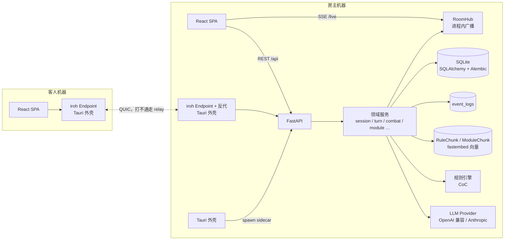
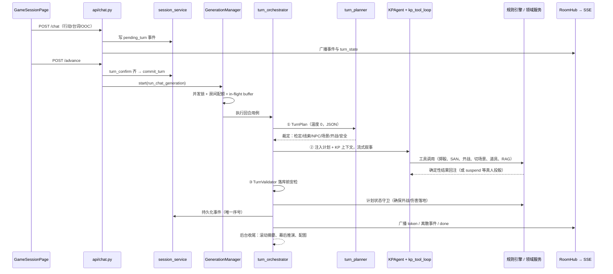

# 设计文档（DESIGN）

本文件记录 CoC Player 的**架构设计**，以及**较重要、跨模块、不易从单个文件读出**的设计决策与
工作机制，描述的是「当前实现的事实」。探索期的过程稿、备选方案与阶段规划见
[`docs/plans/`](docs/plans/)；带约束力的决策见 [`docs/adr/`](docs/adr/)；
一次带评审意见与改进建议的架构快照见 [`docs/architecture.md`](docs/architecture.md)
（那是**评审**，本文件是**事实**，两者角色不同）。

## 目录

**第一部分：架构设计**

- [一、定位与架构约束](#一定位与架构约束)
- [二、运行形态与部署拓扑](#二运行形态与部署拓扑)
- [三、分层与模块边界](#三分层与模块边界)
- [四、核心架构不变量](#四核心架构不变量)（含 [4.8 事实由系统渲染](#48-kp-上下文里的事实由系统渲染不由模型自述)）
- [五、领域数据模型与状态分布](#五领域数据模型与状态分布)
- [六、回合主链路](#六回合主链路)
- [七、实时层：房间事件与重连](#七实时层房间事件与重连)
- [八、规则引擎与 AI 的边界](#八规则引擎与-ai-的边界)
- [九、记忆、检索与上下文预算](#九记忆检索与上下文预算)
- [十、联机与信任边界](#十联机与信任边界)
- [十一、桌面分发链路](#十一桌面分发链路)
- [十二、契约治理与验证门禁](#十二契约治理与验证门禁)
- [十三、关键取舍与已知边界](#十三关键取舍与已知边界)

**第二部分：跨模块机制细节**

- [KP 回合三段式：规划器（TurnPlan）与校验器（TurnValidator）](#kp-回合三段式规划器turnplan与校验器turnvalidator)
- [KP 上下文的事实层：确定性状态全量渲染](#kp-上下文的事实层确定性状态全量渲染)
- [NPC 对外称呼：导入期定名，运行时查表](#npc-对外称呼导入期定名运行时查表)
- [生图提示词：画风纪律与 CLIP 词数预算](#生图提示词画风纪律与-clip-词数预算)
- [六边形沙盘的层级契约](#六边形沙盘的层级契约)
- [地点可见性：门禁、点名与可达](#地点可见性门禁点名与可达)
- [长局上下文：滚动剧情摘要](#长局上下文滚动剧情摘要)
- [重新生成：回滚并重跑最新一轮 KP](#重新生成回滚并重跑最新一轮-kp)

---

# 第一部分：架构设计

## 一、定位与架构约束

CoC Player 是一个**本地优先的 AI 跑团桌面应用**：AI（或真人）担任 KP，玩家可独自开团，
也可邀请朋友通过可信局域网或内置直连隧道加入同一房间。**规则上只实现了 CoC 七版**——
`RuleEngine` 是插件式的，接别的规则系统在架构上是通的，但至今只有 CoC 一套引擎。

产品定位直接决定了几条架构约束，后面的所有设计都从这里推导：

| 产品事实 | 由此确定的架构约束 |
|---|---|
| 玩家的数据（角色、模组、存档、API Key）都在自己机器上 | SQLite 单文件 + 本地素材目录，不引入外部依赖服务；打包时数据落用户可写目录并在迁移前自动备份 |
| 一局游戏＝一个房间，同时在线人数是个位数 | 实时层刻意做成**进程内**广播与锁，不引入 Redis / 消息总线（[ADR-005](docs/adr/ADR-005-进程内实时态与扩展触发条件.md)） |
| 跑团的乐趣依赖规则被严肃对待 | AI 只做**语义裁定**，规则状态一律由确定性规则引擎与领域服务变更（[ADR-004](docs/adr/ADR-004-AI语义裁定与规则确定性变更.md)） |
| 断线重连是常态（笔记本合盖、切网、跨网隧道抖动） | 事件日志 + 稳定序号 + 状态快照对齐，界面任何时候都能从零重建（[ADR-002](docs/adr/ADR-002-事件日志序号与SSE重连.md)） |
| 只面向「朋友之间」，没有账号体系与 TLS | 明确**不支持公网暴露**；信任边界靠监听地址、来源校验与房主批准（[ADR-001](docs/adr/ADR-001-桌面优先与可信局域网边界.md)、[ADR-007](docs/adr/ADR-007-管理端点仅限本机.md)） |
| AI 增强件（规划、摘要、配图、幕后推演）随时可能失败 | 增强件一律 **fail-open**，核心状态机 **fail-closed**（见 [§4.6](#46-fail-open-与-fail-closed-的分界)） |

一句话概括当前架构风格：

> **模块化单体（FastAPI）＋ 事件日志 ＋ 进程内实时广播 ＋ AI 编排管线 ＋ 桌面 sidecar 分发**

## 二、运行形态与部署拓扑

同一套代码支持四种运行形态，差别只在「前端从哪来、后端绑哪、客人怎么连」：

| 形态 | 前端 | 后端 | 场景 |
|---|---|---|---|
| 开发模式 | Vite `5173`（代理 `/api`） | Uvicorn `8000` | 本地开发调试 |
| 桌面模式 | Tauri 窗口指向本机后端 | Rust 外壳 spawn PyInstaller sidecar，FastAPI 同源托管 `apps/web/dist` | 首选游玩方式 |
| 局域网客人 | 客人的 SPA | 客人前端把 `server_url` 指向房主后端 | 同一可信网络多人 |
| 内置直连客人 | 客人的 SPA 指向 `127.0.0.1:<临时端口>` | 请求经 Tauri 外壳内的 iroh QUIC 隧道反代到房主后端 | 不同网络的朋友 |



值得注意的分工：**桌面外壳（Rust）不承载任何业务逻辑**，只做三件事——拉起 sidecar 并等健康检查、
托管窗口、跑内置直连隧道。业务全部在 Python 单体里，因此「桌面版」和「开发版」跑的是同一套代码。

## 三、分层与模块边界

### 3.1 顶层目录

```text
apps/web/              React 19 + TypeScript + Vite 8 + Tailwind 4 前端 SPA
  src/api/             API 客户端 + OpenAPI 生成的 TS 类型（generated.ts 不手改）
  src/pages/           页面级容器
  src/features/        按特性聚合的数据获取 + 纯逻辑（可测）
  src/components/      game / character / module / ui 四类组件
  src/lib/             重连时序、事件分发、主题、地形等纯逻辑
  src/stores/          Zustand 状态容器（会话、模组）
server/app/api/        FastAPI 路由：参数校验、授权、触发生成
server/app/services/   领域服务：会话、回合编排、战斗、追逐、模组、RAG、房间、实时
server/app/ai/         Provider 抽象、AI 配置存储、上下文装配、规划器、校验器、子代理、提示词
server/app/rules/      规则系统抽象 + CoC 确定性实现
server/app/models/     SQLAlchemy ORM
server/app/schemas/    Pydantic 请求/响应模型
server/alembic/        数据库迁移
server/tests/          后端测试；server/evals/ 叙事与指令评测
src-tauri/             Tauri 2 桌面外壳 + netlink（iroh 直连）
docs/adr/              架构决策记录；docs/plans/ 设计稿
```

### 3.2 后端模块边界

| 模块簇 | 主要文件 | 职责 |
|---|---|---|
| 应用入口 | `main.py` | 生命周期（种子初始化 → 迁移 → 维护模式）、来源校验中间件、限流、CORS、SPA 同源托管 |
| 授权 | `api/deps.py` | 全部会话读写的统一授权语义：viewer / actor / token actor / host / manager / kp / local |
| 会话域 | `session_service.py` | 席位与房间码、权限判定、事件仓库与序号；导航与回合态已拆出，此处保留同名 re-export |
| 导航域 | `navigation_service.py` | 谁在哪儿、哪些地点可见（`known_scene_ids`）、连通图与寻路（`find_scene_path`）、沙盘节点下发 |
| 回合态 | `turn_state_service.py` | `turn_state` 的两件事：待投检定台账与回合确认锁——同属「本回合尚未定稿」的短生命周期状态 |
| 回合编排 | `turn_orchestrator.py` | 回合用例编排：开场、玩家行动、检定申请、投骰续写、分头行动、战斗善后、前往、重新生成 |
| 回合支撑 | `turn_context.py`、`turn_effects.py`、`planned_effects.py`、`turn_event_order.py`、`kp_tool_loop.py`、`narration_protocol.py`、`command_protocol.py`、`chat_event_writer.py`、`dice_runtime.py`、`team_turn_service.py` | 上下文取数与校验、确定性副作用、计划落实、事件重排、工具循环与文本兼容路径、叙事流协议、事件落库、骰子协议与检定对象解析、AI 队友回合决策 |
| 生成生命周期 | `generation_manager.py`、`generation_lifecycle.py`、`generation_housekeeping.py`、`ai_quota.py` | 单房间生成锁、错误分类、后台收尾任务、房间级配额 |
| 战斗/追逐 | `combat_service.py`、`chase_service.py` + `rules/coc/combat.py`、`chase.py`、`positioning.py` | 可暂停状态机、先攻队列、方格站位与掩体、抽象距离轨 |
| 模组/规则书 | `module_service.py`、`module_rag_service.py`、`rulebook_service.py`、`module_map_service.py`、`hex_map.py`、`excel_import.py` | 导入解析、结构化、切块与向量检索、六边形沙盘落位 |
| 世界状态 | `world_state.py`、`world_memory.py`、`event_recall.py` | `world_state` 的唯一读写口径；线索台账与 NPC 记忆；本局事件原文的向量索引与回捞 |
| 规则可选项 | `rule_options_service.py` | 模组默认 → 村规 → 本局覆盖三层合并，读时交给引擎（见 [§8.1](#81-规则系统插件化)） |
| 身份呈现 | `npc_identity.py` | NPC 在机制界面上的对外称呼（玩家还没认出来的东西不替 KP 报名） |
| 配图 | `module_image_service.py`、`illustration_service.py`、`character_avatar.py`、`style_presets.py` | 提示词两段式装配、画风预设与词数预算、图片缓存与自愈 |
| 实时层 | `room_hub.py`、`room_events.py`、`room_sync.py`、`event_protocol.py` | 事件类型注册表、SSE 广播、状态快照、线上格式 |
| 叙事流解析 | `narration_protocol.py`（驱动壳）、`narration_scanner.py`、`narration_speakers.py` | 把 KP 的 token 流切成旁白/台词气泡：状态机与说话人归属分开（见 [§8.5](#85-叙事流解析的两层)） |
| 联机边界 | `net_access.py`、`rate_limit.py` | 监听地址与来源三态判定、限流 |
| 真人 KP | `human_kp_service.py`、`human_kp_actions.py` | KP 私有工作区、AI 参谋草稿、发布动作 |
| 收尾产物 | `recap_service.py`、`replay_service.py`、`growth_service.py`、`promote_service.py`、`character_chronicle.py` | 战报、团记导出、成长结算、临场 NPC 转正、把本局经历写成第三人称小传存回角色卡 |
| 新手引导 | `onboarding_service.py`、`content/onboarding.py` | 内置新手团的剧本内容与开局；界面侧是就地导览（遮罩挖洞高亮真实元素），不是另造一套演示数据 |

### 3.3 前端模块边界

| 模块 | 位置 | 职责 |
|---|---|---|
| 路由壳 | `App.tsx`、`components/layout/*` | 13 条路由、布局、错误边界、全局提示 |
| API 客户端 | `api/client.ts` | API base 解析、`X-Player-Token` 按**主机身份**归属、上传、SSE 解析 |
| 直连 IPC | `api/netlink.ts` | 前端唯一不走后端 HTTP 而走 Tauri IPC 的地方（隧道在 Rust 进程里） |
| 实时时序 | `lib/liveSession.ts`、`lib/roomEvents.ts` | 重连循环（先订阅后对齐）、事件三分类与穷尽分发 |
| 纯派生 | `features/game-session/derive.ts` | 从事件流派生界面状态，独立可测 |
| 游戏组件 | `components/game/*` | 战斗 HUD、3D 骰子、调查板、六边形沙盘、追逐、战报、成长 |
| 状态容器 | `stores/sessionStore.ts`、`moduleStore.ts` | 会话与模组的客户端状态 |

## 四、核心架构不变量

这一节是本文档最重要的部分：下面每一条都是**修改代码时不能破坏的约束**，
而不是「建议」。绝大多数已经有对应的 ADR 和回归测试。

### 4.1 AI 只做语义裁定，规则状态由确定性代码变更

自然语言本身永远不改变规则状态。模型能做的只有两件事：产出结构化裁定（`TurnPlan`）、
发起工具调用（`dice_check` / `start_combat` / `scene_change` …）。真正改状态的是
`RuleEngine` 与领域服务，它们的输入输出可测、可重放。

推论：模型漏调工具不能让状态机悬空——规划器一旦裁定开战，后端在叙事收尾时
由 `planned_effects._ensure_planned_combat` 补执行；而后端**不会**用关键词正则从叙事里
猜测发生了什么。详见 [ADR-004](docs/adr/ADR-004-AI语义裁定与规则确定性变更.md) 与
[第二部分的三段式机制](#kp-回合三段式规划器turnplan与校验器turnvalidator)。

### 4.2 一个事件只能有一个稳定序号

`event_logs(session_id, sequence_num)` 上有数据库唯一约束，序号分配与写入在同一事务边界内，
冲突回滚重试；回合内重排使用临时序号区间。序号是重连对齐的水位线，也是历史分页的游标。
`visibility` 列承载可见性（如 `["kp"]` 表示玩家永不可见的幕后事件）。

### 4.3 `world_state` 是剧情记忆容器，有唯一读写口径与版本号

`GameSession.world_state` 曾是「一局游戏的所有状态」的默认落点。ADR-003 之后它被**拆薄**：
凡是有明确 schema、需要并发安全或高频写的状态都搬进了专用表（见 [§5.1](#51-持久化模型)），
留在 JSON 里的收敛为**剧情记忆**——flags、线索台账、NPC/队伍记忆、幕后游标、滚动摘要与游标、
已发手书、结局与结束投票、预算校准系数。

判据是「**这块状态有没有稳定形状**」：形状稳定的（战斗态、回合态、统计、导航）进表，
形状随剧本流动的（剧情记忆）留 JSON。

SQLAlchemy 不追踪 JSON 的就地修改，因此新代码一律走 `world_state.py` 的
`read` / `get` / `set_key` / `mutate`（深拷贝读、整体重赋值写、写入时盖 `SCHEMA_VERSION`，
当前为 2 并带 `migrate`），而不是 `dict(session.world_state)` 再整段回写。
`schemas/world_state.py` 的 `WorldStateSchema` 给稳定键定型，其余键 `extra="allow"` 放行；
**校验刻意 fail-open**——写坏一个字段只告警不阻断，因为它是柔性容器，不该让整局崩掉。
边界与拆表规则见 [ADR-003](docs/adr/ADR-003-world-state边界与版本.md)。

### 4.4 实时态刻意留在进程内

`RoomHub`（`dict[str, list[asyncio.Queue]]`）、`GenerationManager`（`dict[str, asyncio.Task]`）、
限流与配额计数都在单进程内存里。这不是欠债而是选择：桌面版天然单进程，因此不存在
「加了 `--workers 4` 就悄悄失效」的路径。健壮性靠单进程内的手段补齐——队列有界
（`MAX_PENDING_CHUNKS`，积压即终止该连接让它重连）、SSE 心跳 15s、重连按快照对齐。
迁移到 Redis/任务队列的触发条件写在 [ADR-005](docs/adr/ADR-005-进程内实时态与扩展触发条件.md)。

### 4.5 同一房间同一时刻至多一次生成

全应用**唯一**的生成入口是 `GenerationManager.start`——真人发言、AI 队友回合、战斗续跑、
开场、前往、重新生成都汇到这一处。它同时承担并发锁、房间级配额扣减、in-flight 缓冲切换
与 usage 追踪。因此不需要 `generation_id`：任一时刻「当前生成」是唯一的。

### 4.6 fail-open 与 fail-closed 的分界

| 类别 | 失败时行为 | 例子 |
|---|---|---|
| 生成增强件（fail-open） | 退化为无增强，绝不阻塞跑团 | TurnPlan、TurnValidator、滚动摘要、幕后推演、导演信号、配图、NPC 称呼生成、战报、成长、RAG |
| 核心状态机（fail-closed） | 后端确定性保证落地 | 规划已裁定的开战与伤害、事件序号、world_state 写入、授权 |
| 启动期（fail-closed） | 进入维护模式而不是带病运行 | 迁移失败 → 除 `/api/health` 外全部返回可读错误页 |

### 4.7 所有会话读写共用一套授权语义

`api/deps.py` 是唯一入口：`require_session_viewer`（读）、`require_session_actor` /
`require_session_token_actor`（写）、`require_session_host` / `require_session_manager`（管理）、
`require_session_kp`（真人 KP，与玩家席严格分离）、`require_local_client`（管理本机资产）。
历史、搜索、SSE、战斗、追逐、库存、成长、战报都走同一套，不各自解释「谁能看」。

### 4.8 KP 上下文里的事实由系统渲染，不由模型自述

[§4.1](#41-ai-只做语义裁定规则状态由确定性代码变更) 管的是「模型不能改状态」，这一条管的是
反方向：**凡是系统已经确定性知道的事实，必须每轮全量摆进 KP 上下文，不能让模型自己记、
自己推断、自己宣布**。队伍此刻在哪、玩家已经掌握了哪些线索、NPC 该被称作什么——这些都是
系统精确知道的，让模型从对话历史里推断只会得到一个概率正确的答案。

两条具体纪律：

- **全量渲染优于增量记账。** 只在「有变化时」写进上下文的小节，会在记账链路失灵时**完全静默**，
  而静默的缺席无法与「本来就没有」区分。线索台账（`world_memory.format_clue_ledger_section`）
  为此改成把未发现的线索一并列出：即便记账整条失灵，KP 至少看得见清单本身。
- **模型不得宣布确定性事实。** 分组标签、角色位置这类事实只能由后端注入；模型写出来的同类
  标记一律剥掉不采纳（见[事实层小节](#kp-上下文的事实层确定性状态全量渲染)）。

### 4.9 前后端契约可生成、可 diff

REST 契约的单一真源是 `server/openapi.json`，前端类型由 `pnpm api:generate` 生成到
`apps/web/src/api/generated.ts`（不手改）。SSE 事件类型的单一真源是
`services/room_events.py`，通过只为契约存在的 `GET /sessions/{id}/live/_schema`
（`response_model=RoomEvent`）进入 OpenAPI。CI 对两份生成物做 `git diff --exit-code`，
后端改了契约却没重新生成会直接失败。见 [ADR-006](docs/adr/ADR-006-OpenAPI生成与兼容策略.md)。

## 五、领域数据模型与状态分布

### 5.1 持久化模型

| 模型 | 承载 | 架构角色 |
|---|---|---|
| `Module` | 场景、NPC、线索、手书、触发器、幕后真相、沙盘节点、车卡建议、RAG 状态 | 可复用剧本定义 |
| `ModuleChunk` / `Rulebook` + `RuleChunk` | 原文切块 + float32 向量 BLOB | 模组原文 RAG / 规则书 RAG |
| `Character` | 属性、技能、`system_data`、背景、状态、`owner_token`、`origin_character_id` | 玩家/AI 角色资产；参战副本指回客人库里的原件（[ADR-008](docs/adr/ADR-008-角色数据归属与参战副本.md)） |
| `GameSession` | 模组引用、状态、`kp_mode`、`host_token`、`room_code`、当前场景、`world_state`、`kp_state`、`turn_state` | 一局游戏的聚合根 |
| `SessionParticipant` | 席位：`role`（human/ai/kp）、`seat_order`、`is_primary`、`owner_token`、`claimed`、`ready` | 多人房间席位的事实来源 |
| `EventLog` | `sequence_num`、类型、actor、内容、`visibility`、`metadata`、`embedding`（float32 BLOB） | 会话事件日志、重放来源，兼作本局记忆的向量底座 |

`kp_state` 是真人 KP 的私有工作区，**永不进入** `SessionRead`，避免玩家端读到。

从 `world_state` 拆出的**会话状态表**，每张一个子系统、各带 `version` 乐观锁字段：

| 表 | 承载 | 从哪拆出 |
|---|---|---|
| `combat_states` / `chase_states` | 结构化战斗态、追逐态 | 高频强一致，最先拆 |
| `session_navigation` | `party_locations`、`visited_scenes` | 分头判定与地图可达性的事实来源 |
| `session_stats` | `session_usage`、`turn_usage`、`rag_stats` | 运行统计不该和剧情挤一块 JSON |
| `session_ledger` | `san_checked`、`scene_events_seen` | 幂等台账（防重复触发） |
| `session_recaps` | 按 `ordinal` 排的战报条目 | 天然多行，JSON 里存列表是错的形状 |
| `rule_system_options` | 按规则系统存的**村规** + `table_notes` | 跨会话长期沿用，本就不属于某一局 |

### 5.2 会话状态分布在四处

1. **结构化列**：`status`、`room_code`、`current_scene_id`、`player_character_id`、`rule_options` 等；
2. **JSON 列**：`world_state`（剧情记忆）、`kp_state`（KP 私有）、`turn_state`（本回合未定稿）；
3. **专用状态表**：上表六张，形状稳定、需要并发安全的子系统各自成表；
4. **事件日志**：`event_logs`，玩家输入、叙事、骰子、系统、OOC。

这是一个自觉的取舍：结构化列服务查询与外键，JSON 列服务快速演进的剧情状态，专用表服务
形状已经定型的子系统，事件日志服务重放与重连。第 3 类是 ADR-003 的执行结果——早期
`GameSession` 同时是「会话聚合根 + 多子系统状态仓库 + 运行统计仓库」，拆表把后两个角色摘了出去。

### 5.3 回合确认制

非战斗回合采用**确认制**而非轮转制（`turn_state_service.py`）：玩家的发言先以
`metadata.pending_turn` 暂存并广播，所有「需确认」真人都点过推进后（`turn_confirm_state`），
`commit_turn` 把暂存转正并触发生成。
掉线玩家自动豁免，否则一个人关掉浏览器就会让整局永久卡死。进入结构化战斗后，回合模型
切换为**先攻队列**驱动（`turn_index` 指向当前行动者），覆盖确认制。

## 六、回合主链路



**生成入口一览**（全部经 `GenerationManager.start`）：

| 入口 | 触发 | 编排函数 |
|---|---|---|
| 开场 | `POST /{id}/opening` | `run_opening_generation` |
| 常规玩家回合 | `POST /{id}/advance` | `run_chat_generation` → `_run_generation` / `_run_split_generation` |
| 显式申请检定 | `POST /{id}/check` | `run_check_request_generation` |
| 投骰后续写 | `POST /{id}/roll` | `run_roll_generation` |
| 大地图前往 | `POST /{id}/travel` | `run_travel_generation` |
| 战斗善后 | 战斗结束 | `run_combat_aftermath_generation` |
| 重新生成 | `POST /{id}/regenerate` | `run_regenerate_generation` |
| 真人 KP 模式 | `POST /{id}/kp/*` | `human_kp_service` + `initialize_human_session` |

只有「常规玩家回合」跑完整三段式；其余入口刻意保持简单，理由见
[三段式机制的接入点表](#接入点哪些生成路径走三段式)。

**planner 前移**：`TurnPlan` 在 AI 队友回合**之前**就跑，作为本回合的共享契约——队友据
`plan.direction` 派生的导演提示行动（例如把话头递给被冷落的玩家），KP 叙事时再以队友的
实际行动 + 同一份 plan 为准。plan 是「裁定意图」而非「剧本」，队友行动后语义不变。

**分头行动**：分头与否是**确定性状态**——按 `world_state.party_locations` 归并
（`_location_groups`），身处 ≥2 个场景才算分头，不看角色嘴上说要不要分头。分头时逐场景生成，
整回合共用一份 `TurnPlan`，每列以自身所在场景为锚构建上下文并各自过一次校验器，
分组标签由后端注入。队伍位置每轮都会写进 KP 上下文，
见[事实层小节](#kp-上下文的事实层确定性状态全量渲染)。

## 七、实时层：房间事件与重连

### 7.1 事件三分类

`services/room_events.py` 是事件类型的唯一真源：一个 `Literal` 联合 + 一张分类表，
两份清单在导入期 `assert` 对齐。分类决定**持久化、重放、去重**三套完全不同的规则：

| 分类 | 语义 | 持久化 | 去重规则 | 例子 |
|---|---|---|---|---|
| `stream` | 流控与流式片段 | 不进 `event_logs` | 最后一条为准 | `generating`、`done`、`narration`、`typing`、`presence` |
| `log` | 叙事日志 | 进 `event_logs`，带 id 与 seq | 按 id 去重，断线后从 DB 补 | `dialogue`、`action`、`dice`、`narration_full`、`ooc` |
| `sync` | 状态失效通知 | 真值在业务表里 | 后到者覆盖 | `combat_state`、`turn_state`、`seat`、`map_update` |

此前这些类型是散落在 20 多个文件里的裸字符串，扁平命名空间正是重连逻辑要写一堆特判的根因。
现在前端 `lib/roomEvents.ts` 的 `Record<RoomEventType, Category>` 与分发处的 `never` 守卫
共同保证：后端加一种事件而前端没归类或没处理，`pnpm --filter web typecheck` 直接失败。

编码是传输层职责：业务代码只造 `RoomEvent`，`broadcast` 显式拒收裸字符串，
`encode_sse` 是唯一拼 `data:` 前缀的地方——将来换 WebSocket 只需要改这一处和 `stream_room`。

### 7.2 重连时序

```text
断线
  → 退避 1.5s
  → ① 先订阅 /live（期间到达的事件进缓冲区）
  → ② 再对齐：拉历史 + GET /sync（快照注册表 + 事件水位线 seq）
  → ③ 回放缓冲（log 按 id 去重、sync/stream 后到者覆盖，重复应用安全）
  → 恢复正常投递
```

顺序不能反：先对齐再订阅会丢掉两者之间产生的事件，这个窗口在跨网重连时并不窄。
`GET /sessions/{id}/sync` 用一次往返返回所有需要对齐的系统快照（战斗、追逐、回合确认…），
新增一个需要对齐的系统只需在 `room_sync.PROVIDERS` 里加一行，不必改前端重连流程。
协议版本走 `/api/health` 握手，客人连接前比对，不一致明确提示升级。

## 八、规则引擎与 AI 的边界

### 8.1 规则系统插件化

`rules/base.py` 定义 `RuleEngine` 抽象（角色 schema、建卡、校验、技能检定、SAN 检定、
成长检定等），`rules/registry.py` 按 `rule_system` 注册与取用，`rules/coc/` 是唯一完整实现
（建卡与职业、检定与难度分档、战斗与方格站位、追逐、疯狂、装备与武器、专精、状态）。
调用方一律 `get_engine(rule_system)`，不硬编码 CoC。DnD 目前只是**数据类型可选**，
没有规则引擎实现——这一点在 README 里明确标注为未实现。

`CheckResult` 除成败外还带 d100 逐骰明细（`tens` / `tens_kept` / `units` / `bonus` / `penalty`），
供前端 3D 骰子严格还原真实掷骰过程，而不是先给结果再演动画。

**规则可选项（家规）**走 `rule_options_service.py`，三层合并成一份 dict：模组作者的推荐值 →
**村规**（`rule_system_options`，按规则系统存、在规则书页面配置，是这一桌长期沿用的规矩）→
本局覆盖。合并只有「后者覆盖前者」一条规则——都是标量参数，不存在同一个值多来源叠加，
引进优先级只会让「我改的这项到底生效没有」变得不可解释。引擎侧一律**读时覆盖**：
合并结果只在结算那一刻被读，绝不写回角色卡或事件，因此改村规不会污染存量存档。

### 8.2 LLM Provider 抽象

`ai/provider.py` 定义 `LLMProvider`（`complete` / `stream` / `stream_chat`）与流式增量
`StreamDelta`（`text` / `reasoning` / `tool_call`）。工具调用的参数分片由 Provider 内部聚合，
**调用方永远拿到完整的 `ToolCall`**，不需要自己拼 JSON 片段。
`ai/llm_factory.py` 只负责「按激活配置选谁」，实现在 `ai/providers/`（OpenAI 兼容、Anthropic），
文生图后端可挂 ComfyUI，于是任何协议的文本模型都获得配图能力。

配置分「主模型」与「快模型」（`get_llm` / `get_fast_llm`）：低温结构化调用、分诊、
摘要等走快模型，主叙事走主模型。

配置本身存在 `ai/profile_store.py`（读写 `ai_settings.json`，并回答「当前该用哪个配置」）。
它**刻意不在 `api/` 里**：消费者是 `llm_factory`（选 Provider）、`context`（按窗口算预算）、
`image_gen`（选生图后端）与编排服务，全是业务侧；实现寄生在路由文件里会让 `services/` 与
`ai/` 反过来 import `api/`。`api/ai_settings.py` 现在只剩 HTTP 端点。
调用方一律 `from app.ai import profile_store` 后按模块属性调用，测试因此只有**一个打桩点**。

### 8.3 KP 工具注册表与双路径

`ai/tools.py` 是 agent loop 路径的单一真源：每条注册项 = {工具名, OpenAI function schema,
loop 行为}，行为分四类——`check`（掷骰后回注结果续写，挂真人明骰时 `suspend`）、
`lookup`（RAG 检索回注，有每轮配额）、`npc`（触发 NPCAgent 生成台词并落库广播）、
`state`（fire-and-continue 的状态变更）。

供应商不支持工具调用或开关关闭时，保留 `_process_commands` 的方括号文本指令兼容路径。
两条路径共享规划器、校验器、持久化、世界记忆与最终状态守卫。

### 8.4 子代理

| 代理 | 职责 | 上下文策略 |
|---|---|---|
| `KPAgent` | 主叙事与工具循环 | 完整 KP 上下文（预算装配） |
| `NPCAgent` | 单个 NPC 台词 | `build_npc_context`，只给该 NPC 该知道的 |
| `TeamAgent` | AI 队友的结构化行动意图 | `build_team_context`，队友视角 |
| `CombatAgent` | 战斗叙述与关键 NPC 战术决策 | **刻意精瘦**：只给战斗态、本轮结算、场景一句话 |
| `BackstageAgent` | 玩家不在场时世界按 NPC 动机演进 | 低温 JSON；产物只落 KP 可见事件，绝不直接改 flag |

`ai/director_signals.py` 从事件流确定性地算出节奏提示（聚光灯冷落、卡关、未解悬念），
作为规划器的**软输入**，只影响叙事表达，不改世界状态。

### 8.5 叙事流解析的两层

模型吐出的是一股 token 流，要从中切出「旁白」「NPC 台词气泡」，并剔除指令标签。
这件事拆成两层，因为它们的失败形态完全不同：

| 层 | 文件 | 负责 | 典型缺陷 |
|---|---|---|---|
| 状态机 | `narration_scanner.py` | 引号 / 方括号 / `[SAY]` / 后置说话人四态嵌套的字符级扫描 | 半截标记漏给前端、未闭合内容丢失 |
| 说话人归属 | `narration_speakers.py` | 「这句引号是谁说的」的全部启发式 | 气泡挂错名字、替玩家发声 |

`narration_protocol.py` 只剩驱动壳（喂 token、在终止标签处停流、收尾）。

两条纪律：

- **判不出说话人就留旁白，不猜。** 气泡挂错名字比台词留在旁白更伤沉浸感——窗口内出现
  ≥2 个 NPC 主语时直接放弃归属，多说话人场景由 KP 的 `[SAY]` 显式指定。
- **产物不得随分词漂移。** 线上 Provider 怎么切 token 不可控，因此
  `result[0..4]`（旁白、气泡、对话位点、分组）必须与切分方式无关，
  由 `tests/test_narration_protocol_golden.py` 按 1/2/3/5/13 字与整串逐一比对钉住。
  **已知例外**：命令标签终止本次流时，`full_response` 会残留「标签所在整个 token」的尾巴
  （`+= token` 发生在 token 粒度而 `break` 只跳字符循环），而它正是下游指令解析的输入——
  紧跟终止标签的第二条指令可能被解析、也可能不被。该缺口有专门用例记录，未修。

## 九、记忆、检索与上下文预算

长局的核心矛盾是「上下文窗口有限，但剧情会一直长」。当前用五层机制应对：

1. **上下文预算装配**（`ai/context.py`）：按模型上下文窗口推导预算
   （`CONTEXT_BUDGET_WINDOW_FRACTION=0.6`，上限 15 万，默认 48k），分项装配系统提示、
   角色卡、场景、事件全文、摘要，并为输出预留 `RESERVE_FOR_OUTPUT`。
   `context_estimate.py` 复用同一段装配给用户看分项占用，零 LLM 调用。
   装配本身分三步——**取数**（`_collect_kp_facts`，把模组/会话解析成「当前样貌」）、
   **装配**（`_build_system_segments`，遍历 `_SECTIONS` 注册表）、**消息组装**
   （`_assemble_kp_messages`）。分开的理由是失败形态不同：取数错了是**事实错**（给了 KP
   一份不存在的场景），装配错了是**取舍错**（某小节被预算裁掉）。
   新增一节 = 写一个 `_sec_*` 函数 + 在注册表加一行，不必读懂另外二十节；
   注册表顺序即拼接顺序（`priority` 只管超预算时谁先被丢，不要拿它排版）。
2. **滚动剧情摘要**：持久摘要 + 游标，只把游标之后的事件给全文。
   详见[第二部分](#长局上下文滚动剧情摘要)。
3. **本局事件召回**（`event_recall.py`）：给摘要这条**有损管道**配一个**无损底座**。摘要是纯前向
   压缩——游标只进不退，每次浓缩又建立在上一次的产物上（误差复利），因此老剧情在结构上
   不可能被想起来。事件原文一直躺在 `event_logs` 里，缺的只是取回的通路：把 `narration` /
   `dialogue` / `action` 事件按需嵌入（`embedding` 列），检索时连同前后各 2 条一起回捞
   （`CONTEXT_WINDOW`，孤立一句召回没有意义），命中当前场景的加权 `SCENE_BOOST`。
   复用规则书 RAG 那一套（fastembed + SQLite BLOB + 暴力余弦），不引入向量库，
   也不引入 MemGPT / mem0 这类记忆框架——它们绑定整套 agent 运行时。
4. **世界记忆层**（`world_memory.py`）：把「玩家知道了什么」「NPC 记得什么」从上下文推断
   变成 `world_state` 里的持久结构——线索台账（partial/known，不降级）与 NPC 记忆
   （态度/承诺/谎言/最近互动，环形缓冲防膨胀）。纯确定性，零额外 LLM 调用。
5. **按需 RAG**：规则书与模组原文各自切块并存 float32 向量 BLOB，共用
   `vector_search.cosine_top_k` 暴力余弦（千级块，不引入向量库）。模组检索对
   `scene_hint` 命中当前场景的块加权。嵌入走 `ai/embedding.py` 的 `Embedder` 抽象，
   默认 fastembed + `BAAI/bge-small-zh-v1.5`，纯 ONNX、全本地。
   检索由模型在需要时通过 `rule_lookup` / `module_lookup` 工具触发，不是每轮无条件塞进去。

`ai/usage_tracker.py` 用 contextvar 按 asyncio task 隔离地累加一次生成里所有 LLM 调用的
服务端 usage——planner、主叙事、校验器、队友、NPC、幕后、战斗叙述即便用不同 Provider 实例，
也都记进同一个累加器，最终累进 `world_state.session_usage`。

## 十、联机与信任边界

### 10.1 两道闸

局域网可达性**默认关闭**（`services/net_access.py`）：

1. **监听地址**（socket 层，进程启动时决定）：默认只绑回环，关着就根本连不上。
   这是主闸，也是 ADR-001 的可信边界所在；socket 绑定不能热改，所以开关需要重启。
2. **来源校验**（HTTP 中间件，实时生效）：补主闸的两个空档——关掉开关立即对新请求生效；
   即便端口被误转发到公网，非私有网段（含放行的 CGNAT 100.64.0.0/10）一律拒绝。

### 10.2 来源三态与管理端点

`peer_kind` 把来源分成三态而非二值：`local`（房主本机）、`lan`（局域网客人）、
`netlink`（内置直连客人）。区分的必要性在于：隧道会把远端客人的请求以 `127.0.0.1`
反代进来，只看 IP 的话客人会原地变成房主，顺带拿到明文 API Key 与限速豁免。

管理本机资产（AI 配置增删改、素材库删改、Excel 导入、新手团开局）的端点挂
`require_local_client`，只接受 `local`（[ADR-007](docs/adr/ADR-007-管理端点仅限本机.md)）。

### 10.3 内置直连（netlink）

`src-tauri/src/netlink/` 用 iroh QUIC 把远端客人的 HTTP/SSE 送到房主本机后端：

- **身份**：一把持久化的 iroh 私钥（`identity.rs`，unix 下 0600）。不持久化的话，
  邀请码每次重启作废、名册永远匹配不上。
- **邀请码**：`coc:<EndpointId>:<房间码>`（改名前的 `trpg:` 仍可解析），不加密不签名——EndpointId 本就是公钥，
  准入由房主批准把关。
- **准入**：`roster.rs` 名册 + `handshake.rs` 握手。客人连上后第一条流是控制流，
  自报备注名，房主批准/拒绝；自报的名字**不可信**，真身份是 QUIC 握手证明过的公钥。
- **安全契约**：`rewrite.rs` 在转发前**无条件剥离**客户端自带的所有 `X-Netlink-*` 头再注入
  本次隧道的标记。漏掉剥离，客人只要什么都不发就会被后端判成 `local`。
  HTTP 只在房主侧解析（客人侧是纯字节泵），保证 keep-alive 连接上的**每个**请求都经过改写。

### 10.4 身份与配额

玩家身份仍是本地生成的明文 `X-Player-Token`（局域网 MVP），但**按主机身份隔离**：
前端为每个 `server identity` 存一份 token，直连场景下用 `netlink:<房主公钥>` 作为稳定标识，
避免隧道临时端口每次变化导致重连即掉席位。房间内一个 token 只能占一个席位，
由 `session_participants` 的部分唯一索引在 `identity_version >= 2` 时保证。

滥用防护分两层，各管各的：`rate_limit.py` 按来源限流（防外人敲门、枚举房间码，
房间码 40 bit），`ai_quota.py` 按房间限配额（防已经进门的人一直点单烧房主额度，默认关闭）。

## 十一、桌面分发链路

```text
Tauri 窗口 → loader 加载页
  → spawn resources/coc-server/coc-server（PyInstaller onedir sidecar）
  → sidecar 按开关决定绑回环还是全网卡，挑 8756 或随机空闲端口
  → stdout 打印 "COC_BACKEND_PORT <port>"
  → loader 轮询 /api/health
  → 窗口跳转 http://127.0.0.1:<port>
  → FastAPI 同源托管 web_dist + /api + /live（SPA 深链回退 index.html）
```

数据安全在这条链路上是重点：打包模式数据目录切到系统用户可写目录
（mac `~/Library/Application Support/TRPGPlayer`、win `%APPDATA%`、其它 `~/.local/share`；
项目改名为 CoC Player 后这个目录名**刻意不动**——改了等于把老玩家的存档孤立掉），
启动时先从内置种子初始化再跑迁移，**迁移前自动备份**（WAL checkpoint 后复制单文件，保留 2 份），
迁移失败进入维护模式而不是以「新代码 + 旧 schema」带病运行。SQLite 开 WAL + busy_timeout，
让生成写事件时前端拉历史不被阻塞。

## 十二、契约治理与验证门禁

| 契约 | 真源 | 生成物 | 门禁 |
|---|---|---|---|
| REST | `server/openapi.json`（由 `scripts/export_openapi.py` 导出） | `apps/web/src/api/generated.ts` | CI 对两者 `git diff --exit-code` |
| SSE 事件类型 | `services/room_events.py` | 经 `/live/_schema` 进 OpenAPI → 前端字面量联合 | 前端 `Record<RoomEventType, …>` + `never` 守卫，typecheck 失败 |
| 协议版本 | `room_events.PROTOCOL_VERSION` | `/api/health` | 客人连接前握手比对 |

还有三道**没有生成物、纯靠测试立住**的门禁，管的是「不易从代码里看出来、但一破就很贵」的性质：

| 门禁 | 守什么 | 在哪 |
|---|---|---|
| 叙事流金标准 | 状态机行为逐字节不变 + 产物与分词方式无关 | `tests/test_narration_protocol_golden.py`（快照 `fixtures/narration_golden.json`） |
| KP 上下文金标准 | 装配的小节不被悄悄增删；「哪些局面该有哪些小节」写成人读得懂的断言 | `tests/test_kp_context_golden.py` |
| 双路径等价性 | 工具路径与文本兼容路径落库结果一致；新增 `state` 类工具没补用例即失败 | `tests/test_kp_dual_path_equivalence.py` |
| 页面行数红线 | 大页面组件只降不升，撞线时该拆而不是调大数字 | `apps/web/src/test/fileSize.test.ts` |

前两者是**特征化测试**（characterization）：断言的不是「什么才对」，而是「当前就是这样」。
更新快照必须是**有意**改行为，且要在提交信息里说明改了哪几条——它们的全部价值就在于
「没打算改的地方不该动」。重生成命令见各自模块的 `regen_*.py`。

CI（`.github/workflows/ci.yml`）三个 job：后端 ruff + pytest + evals 冒烟 + OpenAPI diff；
前端类型生成 diff + typecheck + build + oxlint；gitleaks 密钥扫描。
`server/evals/` 是叙事与指令质量的离线评测，`--smoke` 模式零 LLM 费用（只验 fixture 可重建、
上下文可构建、ORM 可用），带模型的完整评测本地手动跑。

## 十三、关键取舍与已知边界

**刻意为之的取舍**

1. **单体而非微服务**：领域复杂但并发极小，边界靠模块与端口约束而非网络调用。
2. **单进程实时态**：见 [§4.4](#44-实时态刻意留在进程内)，扩展触发条件写在 ADR-005。
3. **确定性优先**：能用确定性代码算的（世界记忆、导演信号、成长、上下文预估、沙盘落位）
   一律不调 LLM——省钱、可测、可重放。
4. **fail-open 的增强件**：宁可退化也不阻塞跑团，因为跑团是实时活动，卡住比降级更糟。
5. **不重写手写 KP 提示词**：工具注册表只服务 loop 路径，旧正则路径与其手写提示词原样
   保留为降级开关，避免一次伤筋动骨的全量评估回归。

**已知边界（当前不打算解决）**

1. **不支持公网暴露**：没有账号体系、没有 TLS、`X-Player-Token` 是明文串。跨网请走覆盖网络
   或内置直连，不要做端口转发。
2. **`world_state` 的拆表已完成**：战斗、追逐、导航、统计、幂等台账、战报都已进专用表
   （[§5.1](#51-持久化模型)），回合级 `pending_*` 在 `turn_state`。JSON 里剩下的是剧情记忆，
   已在 `WorldStateSchema` 里逐键定型。`extra="allow"` 仍开着（模组设定缓存等随剧本流动的
   东西照旧放行），但**不该再靠它承载已知的键**——校验是 fail-open 的，没声明就等于没人替你
   检查形状（`improvised_npcs` 曾被误声明成 list、运行时全是 dict，就这么静默了很久）。
3. **TurnValidator 只改落库版本**：已流式推给在线玩家的那一瞬收不回。
4. **重新生成不逆转状态**：只清叙事文本与待投骰请求，不回滚 HP / 场景 / flag。
5. **DnD 只是数据类型可选**，无规则引擎实现。
6. **向量检索是应用内暴力余弦**：数据规模上升后需要抽象 `VectorStore`。
7. **页面级大组件仍在**：`GameSessionPage` / `CharacterPage` / `SettingsPage` 均超千行；
   可测的时序与派生逻辑已抽出（`lib/liveSession.ts`、`features/game-session/derive.ts`），
   剩余纯 prop plumbing 的拆分被判定为风险大于收益。这个判断成立，但它此前只是一句话——
   现在由 `apps/web/src/test/fileSize.test.ts` 就地封顶（**只降不升**），
   撞线时正确的反应是把新增内容放进新组件，而不是调大数字。
8. **保留双路径的成本是持续的**：工具路径与文本兼容路径要一直保持行为等价，
   靠 `test_kp_dual_path_equivalence.py` 的契约清单守着（新增 `state` 类工具不补用例即失败）。
   `check` / `lookup` / `npc` 三类因带掷骰随机性或要调模型，仍只有各自的用例。

带评审意见与改进优先级的完整分析见 [`docs/architecture.md`](docs/architecture.md)；
`turn_orchestrator` 的拆分纪律见 [`docs/chat-service-split-discipline.md`](docs/chat-service-split-discipline.md)
（`chat_service.py` 现已退化为 9 行兼容垫片，回合用例编排已迁至 `turn_orchestrator.py`）。

---

# 第二部分：跨模块机制细节

## KP 回合三段式：规划器（TurnPlan）与校验器（TurnValidator）

> 代码：`server/app/ai/turn_planner.py`、`server/app/ai/turn_validator.py`，
> 接入点在 `server/app/services/turn_orchestrator.py`
> （旧路径 `chat_service.py` 现为兼容垫片）。
> 原始设计稿：[`docs/plans/2026-07-01-kp-turn-planner-design.md`](docs/plans/2026-07-01-kp-turn-planner-design.md)。

### 背景与动机

主叙事由 `KPAgent` 一次生成，同时承担「演 KP 讲故事」和「裁定规则」两件事。单次自然语言
生成里这两类职责互相抢注意力，导致高频问题：**该检定的不检定、把 KP 专属线索/秘密泄露给
玩家、输出机械的「汇报体」（`【标题】`+项目符号列表）而非叙事**。

继续往 `KP_SYSTEM_PROMPT` 堆规则只会让注意力更分散（且该提示词有硬 token 预算）。因此把
KP 回合拆成三步——用两个**低温辅助 LLM 调用**把主叙事夹在中间：

```
玩家行动
  │
  ├─①  TurnPlan       低温结构化 JSON：判断「这一轮该怎么裁定」
  │        │          → 作为一条 system 消息（内部工作稿）注入 KP 上下文
  ├─②  KP 工具循环     KPAgent 流式叙事；工具调用由规则/状态服务执行并回注结果
  │        │
  └─③  TurnValidator  落库前廉价安检：违反计划硬约束则改写「落库版本」
           │
        持久化(EventLog) → 计划状态守卫（如确保开战）→ done
```

规划与校验调用 **fail-open**：失败时退回原始 KP 生成，不阻塞跑团；但规划器一旦成功给出
`combat.should_start=true`，战斗状态切换由后端确定性保证，不再因主叙事模型漏调工具而降级。

### 阶段一：TurnPlan（先裁定）

- **触发**：`_run_generation` 中，**仅非开场**（`events` 非空）才跑；开场或规划失败则不注入，
  KP 走原逻辑。分头/单场景都先跑一次，**整回合共用同一份计划**。
- **输入**（`build_turn_plan_messages`）：把运行时资料压成紧凑 JSON——当前场景、玩家/队友
  精简卡、最近 8 条事件、以及**可见范围内**的 NPC 与线索（含 `trigger_condition`）。两条关键约束：
  - 与 `build_kp_context` 用**同一套** `_active_flags` / `_resolve_state` 把场景/NPC 解析到
    「当前样貌」，避免规划器看到的画像与 KP 实际收到的不一致；
  - 遵守可见场景边界（`_visible_scene_ids`），不把玩家尚未到达区域的线索提前喂进去。
- **调用**（`run_turn_planner`）：`temperature=0` + `response_format={"type":"json_object"}`——
  要的是稳定判断而非创作。
- **输出**：Pydantic 强校验的 `TurnPlan`：

  | 字段 | 含义 |
  |------|------|
  | `turn_kind` | 本轮类型：`investigate / social / move / combat / knowledge / roleplay / mixed`（默认 `mixed`） |
  | `player_intent` | 玩家本轮想达成什么 |
  | `requires_check` + `check` | 是否需要检定；技能 / 难度 / 可见性（明暗投）/ 理由 |
  | `clue_policy` | 行动是否匹配线索、候选线索 id、揭示程度、是否需先灵感 |
  | `npc_policy` | 谁开口、反应基调、是否触发 NPC 行动 |
  | `scene_policy` | 是否切场景、set / clear 哪些 flag |
  | `combat` | 是否立即进入结构化战斗、参战敌方名字和开战原因 |
  | `narration_brief` | 叙事要点清单 |
  | `safety` | `do_not_reveal`（硬隐藏信息）、`do_not_control_players` |

- **注入**（`build_turn_plan_message`）：把计划打成一条 system 消息追加到 KP 上下文，消息本身
  带强约束——「这是内部工作稿，别念给玩家 / 不许复述字段名或内部 id / **不许改用汇报体** /
  `requires_check` 就只描述尝试并发起检定 / `combat.should_start` 就必须调用 `start_combat` /
  `do_not_reveal` 不许泄露」。
- **fail-open**：JSON 解析失败或调用异常 → 返回 `None` → 不注入、KP 走原流程。

### 阶段二：KP 叙事（中间）

单场景主路径在 AI 配置启用工具调用且供应商支持时进入 `kp_tool_loop._run_kp_agent_loop`：模型的
文本增量继续实时广播；`dice_check`、`san_check`、`say`、`start_combat`、`scene_change` 等标准工具
调用由工具执行器分发给规则或状态服务，执行结果以 `role=tool` 回注模型，再由模型决定
续写或收束。需要真人掷骰、进入战斗/追逐等工具会返回 `suspend`，立即结束本轮自由叙事。

工具模式关闭或供应商不支持时，系统保留文本指令兼容路径（`kp_tool_loop._process_commands`）。
两条路径共享规划器、校验器、持久化、世界记忆和最终状态守卫；**规则引擎与状态
服务始终是最终执行者**，自然语言本身不直接改变规则状态。

### 战斗切换的确定性保证

`start_combat` 不能只靠主叙事模型“记得调用”。玩家已经明确攻击时，若 KP 只写了冲突描写却
漏掉工具调用，页面只会收到旁白而收不到 `combat_start`，表现为叙事结束后仍停在普通回合。

当前机制把识别与执行分开：

1. `TurnPlan.combat` 结构化给出 `should_start`、`enemies`、`trigger`。规划器只在双方已经进入
   会造成伤害的即时敌对交锋时置为 `true`；威胁、戒备、瞄准或尚未接敌不会误开战。
2. 明确的攻击/射击/格斗宣言会绕过前置的“普通技能检定申请”分诊，确保进入 TurnPlan；该规则
   只决定路由，不凭关键词直接创建战斗，最终仍由规划器结合场景判断。
3. KP 正常调用 `start_combat` 时，工具执行器立即创建战斗态、广播先攻与当前行动者并挂起叙事。
4. 叙事和文本指令处理结束后，`planned_effects._ensure_planned_combat` 检查计划与持久化战斗态：
   计划要求开战但尚无活动战斗时，由后端补执行 `_exec_start_combat`；已有战斗则幂等跳过，
   不会重复开场。
5. 该守卫同时接在单场景工具路径、单场景文本兼容路径和分头叙事收尾，避免模型能力或开关差异
   改变核心状态机行为。

这里仍保持职责边界：模型/规划器负责语义判断“是否开战、敌人是谁”，后端只保证已经作出的
结构化裁定必然落地；不会用关键词正则从一段叙事里猜测战斗。

### 阶段三：TurnValidator（落库前安检）

- **触发**：叙事流跑完、**落库前**，`turn_context._validate_and_patch_narration`；单场景与分头
  每列各校验一次。
- **零成本预筛**（`_looks_suspicious`）：并非每轮都调 LLM。只有满足其一才值得付这次调用——
  (a) `safety.do_not_reveal` 非空（有硬隐藏信息，泄露代价高）；(b) 文本已出现「汇报体」正则
  特征；(c) 出现 `flag_xxx` 这类内部标识。都不满足则直接放行。
- **LLM 校验**（`build_validator_messages`）：让安检模型判断这段旁白是否 ① 泄露 `do_not_reveal`
  （即便转述/暗示）② 汇报体 ③ 出现内部 id / 字段名，返回 `{violated, reason, corrected_narration}`。
- **命中违规**：用 `corrected_narration` **替换落库文本**（`result[0]`），并 `del result[3:]`——
  改写后原文的「对话交错偏移」已失真，落库改走「整段旁白 + 对话追加」的回退路径，保证对话不丢。
- **关键局限**：只改**落库版本**。已经流式推给当时在线玩家的那一瞬收不回；但重连、其他玩家、
  事后复盘看到的都是干净版。
- **fail-open**：无 LLM / 解析失败 / 异常一律放行原文；判定违规却没给改写 → 兜底用原文，绝不清空。

### 接入点：哪些生成路径走三段式

三段式**只接在常规玩家输入的主链路**（`run_chat_generation` → `_run_generation` /
`_run_split_generation`）。其余走 `_run_kp_turn` 的路径**刻意不跑** planner/validator，保持简单：

| 生成路径 | 入口 | Planner | Validator |
|----------|------|:-------:|:---------:|
| 常规玩家输入（单场景） | `_run_generation` | ✓ | ✓ |
| 常规玩家输入（分头分栏） | `_run_split_generation` | ✓（每列注入同一份） | ✓（每列各校验） |
| 回合内检定申请分诊命中 | `run_chat_generation` → `_run_kp_turn` | ✓（复用本回合那一份） | ✗ |
| 玩家从界面显式申请检定 | `_run_kp_turn` ← `run_check_request_generation` | ✗ | ✗ |
| 投骰后续写 | `_run_kp_turn` ← `run_roll_generation` | ✗ | ✗ |
| 大地图前往（travel） | `_run_kp_turn` ← `run_travel_generation` | ✗ | ✗ |
| 开场 | `_run_generation`（`events` 为空） | ✗ | ✗ |

> **检定意图分诊已并入 planner**：原先独立的一次轻量分诊 LLM 调用被 `TurnPlan.player_check_request`
> 取代，省掉一段串行延迟。分诊命中时直接走确定性检定裁定（避免被 KP 当叙事顺过去），
> 不再跑队友回合与常规叙事；明确的战斗宣言（`_looks_like_combat_declaration`）
> 与 `combat.should_start` 不走此路。

### 分头行动下的行为

队伍身处 ≥2 个场景时逐场景生成（`_run_split_generation`）：整回合仍只跑**一次** planner，
其计划注入每一列；每列**各自**过一遍 validator。另外每列以**自身所在场景**为锚构建 KP 上下文
（`build_kp_context(..., viewer_scene_id=...)`），否则各列都会拿到主角场景的资料、把同一场景
重复叙述一遍。每列同时收到完整的队伍位置清单并被告知本轮只演哪一组——别组的人不在场，
不能替他们行动或说话（见[事实层小节](#kp-上下文的事实层确定性状态全量渲染)）。

### 关键取舍

1. **先裁定、再表演**：把「这一轮怎么裁定」先用低温结构化调用定死并作为约束喂给 KP，
   而不是寄望一次自然语言生成同时兼顾表演与裁定。
2. **不直接上完整多 agent**：改动集中、可测试、可回退；每轮只多一次规划调用（validator 靠
   预筛通常跳过）。按职责拆 Rules/Clue/NPC/Narrator 子 planner 留作后续演进。
3. **生成增强 fail-open，核心状态 fail-closed**：规划/校验失败不阻塞叙事；但规划器一旦明确裁定
   开战，后端必须保证战斗态落地，不能让模型漏调工具造成状态机悬空。
4. **Validator 只补落库版本**：承认「已流式内容收不回」，用最低成本保证持久化记录干净。

### 相关代码与测试

- 规划器：`server/app/ai/turn_planner.py`（`TurnPlan` / `build_turn_plan_messages` /
  `run_turn_planner` / `build_turn_plan_message`）
- 校验器：`server/app/ai/turn_validator.py`（`_looks_suspicious` / `validate_turn_narration`）
- 接入：`server/app/services/turn_orchestrator.py`（`_run_generation` / `_run_split_generation`）、
  `kp_tool_loop.py`（`_run_kp_agent_loop` / `_process_commands`）、
  `planned_effects.py`（`_ensure_planned_combat`）、`turn_context.py`（`_validate_and_patch_narration`）
- 测试：`server/tests/test_turn_planner.py`、`server/tests/test_turn_validator.py`、
  `server/tests/test_kp_tool_loop.py`、`server/tests/test_chat_service.py`

---

## KP 上下文的事实层：确定性状态全量渲染

> 代码：`server/app/ai/context.py`（`build_kp_context` 的易变段装配）、
> `server/app/ai/prompts/kp_system.py`（`PARTY_LOCATION_SECTION`）、
> `server/app/services/turn_context.py`（`_location_groups`）、
> `server/app/services/world_memory.py`（`format_clue_ledger_section`）。

[§4.8](#48-kp-上下文里的事实由系统渲染不由模型自述) 的落地形态。KP 上下文里有一层
「事实小节」，每轮由后端从确定性状态**全量**渲染，与叙事历史并列给模型。

### 已有的事实小节

| 小节 | 数据源 | 解决的问题 |
|---|---|---|
| 队伍此刻的位置 | `_location_groups`（按 `world_state.party_locations` 归并，缺记录回落到 `current_scene_id`） | KP 从对话里的「我们分头吧」推断队伍已分头 |
| 线索台账 | `world_state.clue_ledger` + 当前可见线索全集 | KP 对已发现的线索重演一次「发现」桥段 |
| NPC 记忆 | `world_state.npc_memory` | NPC 忘记自己许过的承诺、说过的谎 |
| 封路清单 | `world_memory.blocked_scenes` | KP 放玩家走一条已经堵死的路 |

「全量」指的是**不因「本轮没变化」而省略**，不等于不受预算约束：这些小节仍参与
[§9](#九记忆检索与上下文预算) 的分段装配，个别小节自身也有防膨胀设计
（如 NPC 记忆的环形缓冲）。要紧的是它们不会静默缺席——缺席无法与「本来就没有」区分。

### 为什么位置这一节必须存在

这是从一次真实故障倒推出来的。某局四名角色都在「街区」（`party_locations` 归并只有一组，
系统据此走单场景路径、只跑一次生成），但当时的上下文里只有一个全局「当前场景」、没有谁在哪；
KP 看到的历史里全是角色在商量分头，于是判定队伍已经分开，自行标出一个模组里根本不存在的
「诺特的事务所」分组，整轮只演了那一组——同轮另外三人的行动与一次侦查检定就此没有下文
（系统只跑了一次生成，不存在第二组的补演）。

小节内容随分组数切换，并附一句纪律：

- 全队同处一地：明写在一起，并点破**「说要分头」不等于「已经分头」**——位置只在真的移动后才变。
- 队伍已分头：逐组列出谁在哪，并指明本轮只叙述哪一组（按 `viewer_scene_id` 定），
  不得书写别组的人此刻在做什么。

### 分组标签只能由后端注入

分头路径（`_run_split_generation`）本就是逐组生成、由后端把 `group_label` 确定性写进每段产物的。
KP 侧曾另有一段 `[GROUP: scene=…]` 说明教它自己打标记，而 `scene=` 后是自由文本、解析后照单全收，
于是模型虚构的地名可以直接落库成分组。现在这段说明已删除；`narration_protocol` 仍会**剥掉**模型
写出的 `[GROUP]` 标记（避免漏到玩家眼前），但**不再采纳**其分组。

一句话概括这里的分工：**分头与否是状态，不是修辞**——由 `party_locations` 决定，模型只负责在给定的
那一组里把戏演好。

### 相关测试

`server/tests/test_party_location_context.py`（小节渲染与两种纪律）、
`server/tests/test_chat_service.py::test_kp_self_declared_group_is_ignored`（自述分组不采纳）。

---

## NPC 对外称呼：导入期定名，运行时查表

> 代码：`server/app/services/npc_identity.py`（运行时）、
> `server/app/services/module_service.py`（`generate_npc_callings` / `_alias_candidates`）、
> 回填脚本 `server/scripts/backfill_npc_callings.py`。

**问题**：模组档案里的 NPC 名同时充当 KP 侧唯一标识与玩家侧显示名。对怪物这就是剧透——
叙事里写着「一团比夜色更浓的黑」，旁边的对抗检定卡却印着「田间潜随者（莎布·尼古拉丝化身）」。

### 判据：玩家从哪里认识这个名字

`NameMasker` 判断「玩家此刻认不认得」，判据是**玩家看得见的正文**，三个来源合成一段 prose：

1. 本局公开的 `narration` / `dialogue` 事件（剔除仅 KP 可见的）；
2. 模组的 `world_setting.player_brief`——它按定义就是「玩家角色开场本就知道的前情」，
   委托人、雇主必然写在里面。不认它的话，开场第一句叙事之前所有 NPC 一律是陌生人；
3. 本轮尚未落库的正文（已累计旁白 + 本轮已出台词 + 这一句）——旁白刚写完「诺特先生放下账本」，
   紧接着的气泡不该还叫他「陌生男性」。

刻意**不含** dice/system/action 事件：机制事件里的名字正是本模块要遮的东西，拿它当判据会自我实现。

揭示分三级（`split_name` 把「外号（神话身份）」拆开）：神话身份出现过 → 全名；只有外号出现过 →
只给外号；都没出现 → `unknown_as`。

### 称呼表：为什么必须在导入期定

中文音译名是「名·姓」结构，而场上永远说「姓+敬称」。某局叙事里出现过 10 次「诺特先生」、
**0 次**「史蒂芬·诺特」，于是这位一开场就雇了调查员的委托人整局都被界面称作「陌生男性」。

放宽成按姓氏匹配会翻车得更狠：同一局里「科比特」出现 3 次（宅子就叫科比特老宅）、
「马卡里奥」3 次（同姓一家三口），一放宽就把不死巫师与活尸小女孩的真名当场解锁。
**「同一个字眼指的是人还是房子」只有看得见整本模组时才判得了**，那是导入期，不是运行时。

因此 NPC 增加两个导入期字段，运行时只查表：

| 字段 | 生成方式 |
|---|---|
| `aliases` | 候选由全名按「·」**机械拆出**（召回确定性——实测让模型直接生成，「佐利」这种最该有的单名时给时不给），模型只做 `reject`（这一段其实指地名/家族名）与 `extra`（敬称、绰号、职务称呼）这类判断题 |
| `unknown_as` | 模型按「玩家第一眼看到的样子」给。只喂 `name` + `description`，**不给** `secrets`/`background`——把秘密摆在模型面前，它会写出「不死恶魔」这种一句话揭底的遮罩（存量数据里确实有） |

### 运行时的两道消歧闸

导入期的裁决不保证前后一致（实测同一家三口出现过一漏两中），所以运行时对别名再兜一道：
**指认不到唯一一人的别名一律不作数**——(a) 被多个 NPC 列为别名的；(b) 虽只有一人列、
但它是另一个 NPC 全名一部分的。档案全名无条件保留（KP 写全名就是点名道姓）。
另有数据卫生：单字别名不收（中文里随便一句话都撞得上）。

### 遮的是什么

只遮**机制界面的名字字段**：对话气泡说话人、检定卡、对抗卡、战斗面板、遭遇配图卡标题。
KP 的叙事正文一个字不动，生图提示词与缓存回写仍用真名（那不给玩家看）。

存量模组用 `backfill_npc_callings.py` 补，默认只预览、只补空缺（`unknown_as` 已有值不动：
实测重写有得有失，「鼠群」会被改成「不明存在」、性别没写明的青年会被猜成「陌生男性」）。

### 相关测试

`server/tests/test_npc_identity.py`、`server/tests/test_npc_callings.py`。

---

## 生图提示词：画风纪律与 CLIP 词数预算

> 代码：`server/app/services/module_image_service.py`（`trim_prompt` / `style_discipline` /
> `style_suffix_for`）、`server/app/services/style_presets.py`（画风预设）。
> 四条生图路径共用：模组配图、局内插画、真人 KP 配图、角色头像。

生图是两段式：**快模型把条目写成一行英文提示词，系统在其后统一追加画风后缀**
（会话 > 模组 > 默认档 `manga_noir`，内容红线永远在最末）。

这套分工原先有两个漏洞，表现为同一本模组的两张场景图一张是高反差黑白照片、一张是纯白底线稿：

| 漏洞 | 修法 |
|---|---|
| **词数超了 CLIP 窗口。** SD 系模型的 CLIP 文本编码一次只吃 77 token，画风后缀本身占三十来词；正文再写四五十词，后缀就掉进第二个 chunk、权重骤降，模型回落到自己的默认倾向（实测环境 ComfyUI + SDXL base 1.0，倾向是写实摄影）。原先的 `[:500]` 是按**字符**截的，约等于 75 词，形同虚设 | `trim_prompt()` 按逗号累加到 **35 词**封顶（砍在逗号处不留半个短语）。词数要求同时写进提示词，但模型照做与否是概率问题，超限一次就是一张跑掉的图，必须硬截 |
| **写提示词的模型不知道画风是什么。** 各 `*_PROMPT_SYS` 要求它写「光影、天气与年代质感」，它照做，写出 `warm golden sunlight`、`urban realism`——正好和 `muted low-saturation, gritty dark comic` 顶着来 | `style_discipline(suffix)` 把本次画风原文交给它，并禁掉媒介词与**整类**调色词 |

第二条的禁令必须按**类**下：头一版只列了 `vibrant`/`colorful`/`saturated`，模型立刻换成
`muted sepia tones` 接着犯——低饱和确实照做了，可 sepia 正是老照片的颜色。列举追不上换词，
只能整类收走：光影照写（光源与明暗关系），**色调裁量权全部归画风那一段**。

控制变量对照（同一句正文、同一个后缀，唯一变量是长度）：

| 正文 | 总长 | 出图 |
|---|---|---|
| 63 词 | 98 词 | 写实照片 |
| 27 词 | 62 词 | 标准墨线漫画 |

另外 `SCENE_PROMPT_SYS` 补了一条：`chapter` 类场景说的是一段情节而非一个地方，
需先从描述里推断这件事发生在哪儿再画那个地方的空镜，否则模型每次自己现编一个不同的地点。

### 相关测试

`server/tests/test_image_prompt_budget.py`（词数收口与纪律内容）。

---

## 六边形沙盘的层级契约

> 代码：`server/app/services/hex_map.py`（`scene_parent` / `_synced_map_nodes` /
> `ensure_module_map`）、`apps/web/src/components/game/HexSandbox.tsx`、
> `apps/web/src/pages/GameSessionPage.tsx`。

沙盘是**分层**的：室内场景可归到某个父级地点之下，双击下钻进子沙盘。关键契约是
**各层坐标空间彼此独立**——顶层的 `(0,0)` 与某个子沙盘的 `(0,0)` 是两个格子。
区分它们全靠节点上的 `parent`（空 = 顶层）。

`parent` 有两份拷贝，必须一起维护，漏一处就会把子层的格子按子层坐标画进顶层坐标空间，
两层叠在一起：

| 位置 | 维护者 | 漏掉的后果 |
|---|---|---|
| `scenes[].map.parent` | 归组（`infer_scene_parents`）与落位 | 落位器把子级摊在子沙盘四角，看着像没归组 |
| `map_nodes[].parent` | `_synced_map_nodes` 从场景同步 | 玩家未发现的场景会被清掉 `scene_id` 当地貌格下发，那时节点自己的 `parent` 是唯一层级来源 |
| 前端 `locations[].map.parent` | 两个页面各自组装 | 子沙盘的场景与地面全部平铺到顶层 |

一次真实故障串起了这三处：某模组街区的 6 块内景地面压在了顶层的疗养院与礼拜堂上，
地貌格的透明命中区吃掉点击、而它自己不响应「前往」，表现为**有标签、没图标、点不动**。

两条随之确立的纪律：

- **改动判定要连 `map_nodes` 一起看。** `ensure_module_map` 原先只看 scenes 变没变，
  于是「归组早已跑完、只有节点缺 `parent`」的存量模组永远等不到同步。
- **场景节点的层级以场景为准**（`scene.map.parent ?? node.parent`），地貌节点用自己身上的。
  两个来源都要认：只认前者子沙盘里一块地也没有，只认后者场景节点会拿子层坐标画进顶层。

### 相关测试

`server/tests/test_hex_map.py`（`TestSceneHierarchy` 一组）。

---

## 地点可见性：门禁、点名与可达

> 代码：`server/app/services/navigation_service.py`（`known_scene_ids` /
> `list_known_locations._unlocked`）、`server/app/services/hex_map.py`（`scene_parent`）、
> `apps/web/src/components/game/HexSandbox.tsx`。

上一节管的是「格子画在哪一层」，这一节管的是「哪些格子该出现」。两条规则各自都对，
凑在一起会打架：

| 规则 | 目的 |
|---|---|
| **层级门禁**：挂在父级之下的场景，父级被**真正到过**之前不可见 | 防剧透——开局就不该知道村里有几间屋子；也给子沙盘一个明确的解锁时刻 |
| **主沙盘只画顶层格子**（`map.parent` 为空），子地点要点父级下钻才看得到 | 各层坐标空间独立（见上节） |

冲突出在 KP 挂出「要前往【科比特的老房子】吗」的时候：老房子挂在「街区」之下，
而街区既没被访问过、也没被点名。玩家收到了邀请，地图上却无路可达。

判据是**这个地方有没有被点名**：

- `world_state.travel_suggested` 是 KP 挂过前往建议的确定性记录。被点名的场景解除层级门禁——
  藏着只剩坏处，剧透在 KP 说破的那一刻就已经发生了。
  （刻意不去卡片文案里匹配场景名：措辞一改或名字对不上，地点就会莫名其妙地消失。）
- 被点名的场景还要把**父级链**一并带出来（沿 `scene_parent` 上溯，限深 8 防模组把 `parent` 配成环），
  否则下钻入口不存在，数据给了等于没给。
- **只对被点名的做，不对「叙事提过」的做**：听说过村里有屋子 ≠ 该在图上标出村子，
  那些本就该按门禁慢慢解锁。父级带出来只是「已知」不是「已访问」——同一父级下的其它屋子
  仍被门禁挡着，露出来的只有被点名的那一间。

另有两条既有边界一并记在这里：`connections` 只回展示集合内的邻居（未知地点绝不经边泄露）；
真人 KP 的上帝视角（`reveal_all`）返回全部场景并附 `known` 标记，由前端纯客户端过滤，
玩家侧永远走迷雾路径。

### 相关测试

`server/tests/test_hex_map.py::TestSuggestedUnlocksNested`（点名解锁、只解锁被点名的那一个、
子地点可见时父级必须一起可见）。

---

## 长局上下文：滚动剧情摘要

> 代码：`server/app/ai/story_summarizer.py`、`build_kp_context`（`server/app/ai/context.py`）、
> `_maybe_roll_story_summary`（`server/app/services/generation_housekeeping.py`）。

**问题**：KP 上下文按 token 预算装配「最近事件全文 + 更早事件的即时摘要」。游戏一长，
即时摘要（`_summarize_old_events`）只能粗暴截断老事件，KP 逐渐「失忆」中段与近段剧情、
原地打转、复读开场式内容。KP 叙事的 LLM 调用本身**不设 max_tokens 上限**，所以这不是
输出长度问题，而是上下文装配问题。

**机制**：维护一份**持久滚动摘要**，随游戏增量更新：

- `game_session.world_state.story_summary`：截至某点的剧情梗概；
  `story_summary_seq`：已并入摘要的最后一条事件 `sequence_num`（游标，默认 0）。
- **何时滚动**：每轮 KP 生成收尾（`done` 之后）调用 `_maybe_roll_story_summary`。当「游标之后
  未并入摘要的事件」超过 `STORY_SUMMARY_TRIGGER(24)` 时，把其中除最近 `STORY_SUMMARY_KEEP_RECENT(12)`
  条以外的较老事件，连同既往摘要交给 `story_summarizer.summarize_story` 低温浓缩成新摘要，
  推进游标。不够阈值则零成本返回，不额外调用 LLM。
- **如何使用**：`build_kp_context` 只把「游标之后」的事件按预算给全文，`story_summary` 作为
  `[之前发生的剧情摘要]` 注入；游标之前的老事件不再逐条进上下文。游标默认 0 → 与旧行为一致。

**fail-open**：摘要生成失败（无 LLM / 异常 / 空）保持原摘要与原游标，绝不阻塞跑团。

---

## 重新生成：回滚并重跑最新一轮 KP

> 代码：`generation_manager.cancel`、`session_service.rollback_last_kp_output`、
> `turn_orchestrator.run_regenerate_generation`、`POST /{session}/regenerate`；
> 前端在 `GameSessionPage.tsx`。

**问题**：生成到一半断网时，KP 侧会卡住（僵死 task 占着并发锁、`done` 永不来），且断流时
落库的半截叙事会污染下一轮上下文。

**流程**（高风险，前端红色二次确认后才触发，仅作用于最新一轮）：

1. `generation_manager.cancel`：取消并等待卡住/进行中的生成 task 真正结束（其半截叙事会先落库）。
2. `rollback_last_kp_output`：删除「最后一条玩家方输入之后」的 KP 叙事产物——旁白、NPC 台词、
   待投骰的检定请求（并清对应 `pending_checks`）；**保留**玩家/队友输入与已投出的骰子结果。
3. `run_regenerate_generation`：用清理后的事件流只重跑 KP（不重跑队友回合、不做检定意图分诊）。
4. 前端点确认即进入「KP 思考中」并 `resyncHistory`——旧叙事从界面立即消失，随后 `/live`
   流式推入重生成内容。

**决策**（经确认）：仅重跑 KP、保留玩家+队友输入；保留已定骰子不重掷；任意时候可对最新一轮重来。

**局限**：回滚只清叙事文本与待投骰请求，**不逆转** HP/场景切换/剧情 flag 等状态变更。
