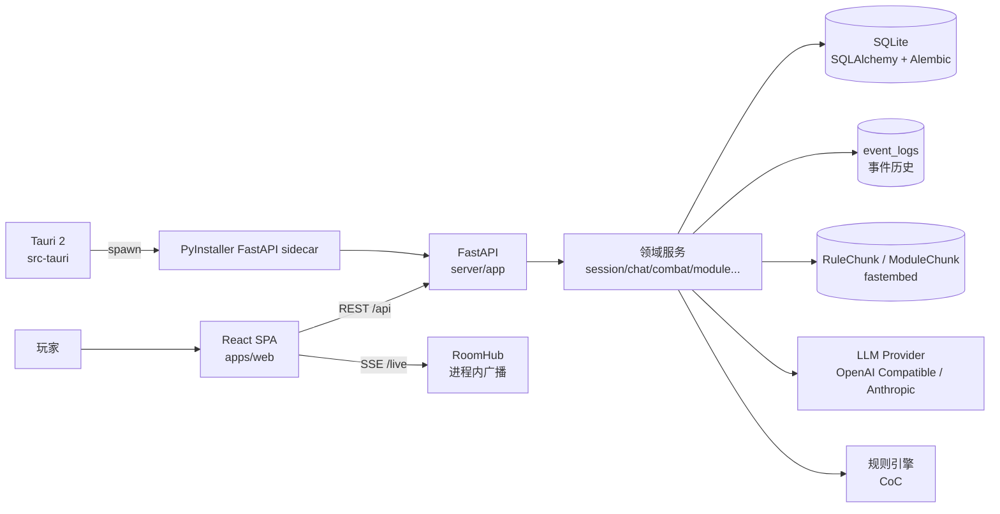
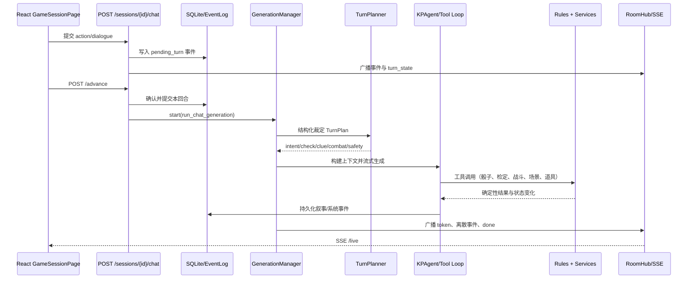

# CoC Player 现状架构与架构评审

> 文档版本：v1.2
> 梳理日期：2026-07-19；2026-07-27 按「实时层与联机边界」一轮改动更新；
> 2026-07-31 按「单体拆分、内置直连与角色数据归属」一轮复核更新
> 更新原则：**不重写评审结论**，只把已落地的条目就地标注现状（保留原始描述，
> 以便看清当初为什么这么判断），并在 §8 开头加本轮小结。
> 本轮同样标注**未落地甚至恶化**的条目——只记好消息的现状标注没有价值。
> 适用范围：当前仓库代码、配置、测试、打包文档；不把设计稿中的规划能力当作已实现能力。

本次梳理同时参考了代码知识图谱与仓库文件：当前项目索引约含 6,325 个节点、23,459 条关系，识别出 78 个路由节点；关键规模指标以源码行数为准，避免把图谱中的测试/fixture 节点误当成生产代码。

## 1. 一页结论

CoC Player 当前是一个**桌面优先、单体后端、事件驱动交互、AI 增强规则执行**的 TRPG 应用：

- 前端是 React 19 + TypeScript + Vite 的 SPA，通过 REST 与 SSE 和后端通信。
- 后端是 FastAPI + SQLAlchemy + Alembic 的 Python 单体，按 API、服务、AI、规则、模型、Schema 分层。
- 数据默认落在 SQLite；会话事件使用 `event_logs` 记录，实时输出使用进程内 `RoomHub` 广播。
- AI 不是直接修改世界状态，而是通过 TurnPlan、KP Agent、工具执行器和确定性规则服务间接推进状态。
- 桌面模式由 Tauri 2 启动 PyInstaller 打包的 FastAPI sidecar，并由后端同源托管前端静态资源。

从架构设计角度看，当前方案适合“单机游玩 + 可信局域网联机 + 快速迭代”，不适合直接演进为公网 SaaS。最大的结构性问题不是技术栈选错，而是**单体内部的职责边界、共享状态并发模型、实时层持久化策略、前后端契约治理尚未形成稳定的架构约束**。

建议优先级：

1. 先补齐信任边界和数据并发约束，避免继续扩大安全与一致性风险。
2. 再把生成编排、战斗状态机、世界状态写入从超大服务文件中拆出稳定端口。
3. 最后再考虑 Redis/任务队列/独立服务等扩展，不建议当前阶段直接微服务化。

> **现状（2026-07-31）**：第 1 条走完了「不需要账号体系就能做的部分」（局域网默认关闭、
> 来源三态判定、管理端点仅限本机、房间码强度与限流、房间级配额、内置直连的公钥准入）；
> 第 2 条完成了**生成编排**这一半（`chat_service` 拆分，2026-07-22），
> **世界状态写入与会话服务未动**；第 3 条按 ADR-005 依旧不做。
> 逐条对照见 [§8 的 2026-07-31 一轮复核](#2026-07-31-一轮复核单体拆分内置直连角色数据归属)。

## 2. 架构画像

### 2.1 架构风格

当前系统可以归类为：

> **模块化单体（Modular Monolith） + 事件日志（Event Log） + 进程内实时广播（In-process Pub/Sub） + AI 编排管线（AI Orchestration Pipeline） + 桌面 sidecar 部署**

它同时包含五种运行形态（末一种为 2026-07-29 新增）：

| 形态 | 前端 | 后端 | 适用场景 |
|---|---|---|---|
| 开发模式 | Vite `5173` | Uvicorn/FastAPI `8000` | 本地开发、调试 |
| 单机源码运行 | Vite 或后端静态托管 | Python 进程 + SQLite | 开发测试 |
| Tauri 桌面模式 | Tauri 窗口 | Rust 启动 PyInstaller sidecar，FastAPI 同源托管 SPA | 首选游玩方式 |
| 局域网客人模式 | 客户端 SPA | 客户端通过 `server_url` 访问房主 FastAPI | 可信局域网多人 |
| 内置直连客人模式<br>**新增（2026-07-29）** | 客户端 SPA 指向 `127.0.0.1:<临时端口>` | 请求经 Tauri 外壳内的 iroh QUIC 隧道反代到房主 FastAPI | 不在同一网络的朋友 |

### 2.2 部署拓扑



桌面启动链路由 `src-tauri/src/lib.rs` 实现：启动 sidecar、读取 `COC_BACKEND_PORT`、等待后端健康检查，退出时杀掉子进程。后端在 `server/app/main.py` 中按需挂载 `apps/web/dist`，因此桌面模式是“一个窗口 + 一个本地服务进程”，不是把业务逻辑放进 Rust。

> **现状（2026-07-31）**：外壳新增 `src-tauri/src/netlink/`（iroh QUIC 隧道 + 准入名册），
> 这是**唯一**跑在 Rust 侧的运行时能力。它仍不承载业务逻辑——只做字节转发与准入，
> 后端（Python）甚至不知道它存在。上面「不把业务逻辑放进 Rust」的判断依然成立。

## 3. 代码框架

### 3.1 顶层目录与职责

```text
apps/web/              React/Vite 前端 SPA
apps/web/src/api/      OpenAPI 导出的 REST TypeScript 类型
server/app/api/        FastAPI 路由与请求编排
server/app/services/   会话、聊天、战斗、模组、RAG、房间等业务服务
server/app/ai/         LLM provider、上下文、planner、agent、工具、摘要
server/app/rules/      规则系统抽象与 CoC 确定性规则实现
server/app/models/     SQLAlchemy ORM 模型
server/app/schemas/    Pydantic 请求/响应模型
server/alembic/        数据库迁移
server/tests/          后端单元测试、API 测试、状态机测试
server/evals/          需要 fixture/模型评估的叙事与指令评测
src-tauri/             Tauri 2 桌面外壳与 sidecar 管理
src-tauri/src/netlink/ 内置直连组网：iroh 隧道、准入名册、邀请码、请求头改写（2026-07-29 新增）
loader/                桌面启动加载页
docs/adr/              架构决策记录（当前 ADR-001 ~ ADR-008）
docs/                  设计、路线图、打包和架构文档
```

### 3.2 后端模块边界

| 模块 | 主要文件 | 当前职责 |
|---|---|---|
| 应用入口 | `server/app/main.py` | FastAPI 生命周期、迁移、CORS、健康检查、SPA 静态托管 |
| API 层 | `server/app/api/*.py` | 路由、参数校验、权限调用、触发异步生成 |
| 会话域 | `session_service.py`（门面）、`event_store.py`、`turn_state_service.py`、`navigation_service.py`、`models/session*.py`<br>**已拆职责簇（2026-08-15）** | 会话、席位、房主；事件分页/检索/落库 → `event_store`，回合确认与待投检定 → `turn_state_service`，场景位置与地图可见性 → `navigation_service`。`session_service` 保留同名 re-export |
| 聊天/生成域 | ~~`chat_service.py`~~ → `turn_orchestrator.py` 等 12 个模块<br>**已拆分（2026-07-22）** | 玩家行动、OOC、回合推进、KP 生成、文本指令、工具执行、持久化、收尾。现按职责簇分布在 `turn_orchestrator`（用例编排）、`turn_context` / `turn_effects` / `planned_effects` / `turn_event_order`（取数、确定性副作用、计划落实、事件重排）、`kp_tool_loop`（工具循环与文本兼容路径）、`narration_protocol` / `command_protocol` / `event_protocol` / `chat_event_writer`（协议与落库）、`generation_manager` / `generation_lifecycle` / `generation_housekeeping`（生命周期）。详见 §8 本轮小结 |
| 战斗/追逐域 | `combat_service.py`、`chase_service.py`、`rules/coc/combat.py` | 战斗/追逐状态机与规则结算 |
| 模组/规则书域 | `module_service.py`、`rulebook_service.py`、`module_rag_service.py` | 上传、解析、结构化模组、规则书切块与 RAG |
| AI 域 | `ai/context.py`、`ai/turn_planner.py`、`ai/agents/*` | 上下文构建、结构化裁定、叙事、NPC/队友/幕后代理 |
| 状态记忆域 | `world_state.py`、`world_memory.py` | `GameSession.world_state` 的读写、线索、NPC 记忆、剧情标志 |
| 实时域 | `room_hub.py`、`generation_manager.py` | SSE 订阅、房间广播、单房间生成锁、in-flight 缓冲 |
| 数据访问 | `database.py`、`models/*`、`alembic/*` | SQLite 连接、WAL、迁移、备份、种子初始化 |
| 规则引擎 | `rules/base.py`、`rules/registry.py`、`rules/coc/*` | 规则系统注册、角色计算、检定、战斗规则 |

### 3.3 前端模块边界

| 模块 | 主要文件 | 当前职责 |
|---|---|---|
| 路由壳 | `apps/web/src/App.tsx`、`components/layout/*` | SPA 路由、布局、错误边界、全局提示 |
| API 客户端 | `apps/web/src/api/client.ts` | API base、`X-Player-Token`、JSON 请求、上传、SSE 解析 |
| 页面 | `pages/*.tsx` | 首页、模组、规则书、角色、游戏、房间、设置 |
| 游戏域组件 | `components/game/*` | 聊天、掷骰、战斗、追逐、调查板、战报、成长 |
| 角色域组件 | `components/character/*` | CoC 车卡、装备、技能、角色编辑 |
| 状态 | `stores/sessionStore.ts`、`stores/moduleStore.ts` | 会话列表、当前会话、事件消息、流式消息、模组列表 |
| 特性模块 | `features/onboarding/*`、`features/characters/*`、`features/game-setup/*` | 引导、角色列表、建房/入房流程 |
| UI 基础设施 | `components/ui/*`、`index.css` | Radix UI 封装、主题、弹窗、提示、基础样式 |

前端目前存在明显的页面级大组件：`GameSessionPage.tsx` 约 1,930 行、`CharacterPage.tsx` 约 1,495 行、`SettingsPage.tsx` 约 1,217 行。它们承担了较多 API 调用、交互状态和视图拼装职责。

> **现状（2026-07-31）：这条不但没有改善，还在恶化。** `GameSessionPage.tsx` 2,197 行、
> `SettingsPage.tsx` 1,772 行、`CharacterPage.tsx` 1,558 行，另新增 `HumanKpPanel.tsx` 1,425 行。
> 与此同时，可测的**纯逻辑**确实在持续外移：`lib/liveSession.ts`（重连时序）、
> `lib/roomEvents.ts`（事件分类分发）、`features/game-session/derive.ts`（页面派生）、
> `features/netlink/*`（直连房间列表、敲门通知、自动启动）、`api/playerToken`、
> `features/characters/syncBack`，前端测试文件已从个位数增至 27 个。
>
> 所以准确的描述是：**新功能仍在往大组件里加，但每加一块都会把可断言的逻辑抽出去测**。
> 组件本身的 JSX 拆分依旧被判定为「纯 prop plumbing、收益低于风险」而刻意未做（见 §8 的 P1 表）。

## 4. 数据与领域模型

### 4.1 核心持久化模型

| 模型 | 存储内容 | 架构角色 |
|---|---|---|
| `Module` | 模组描述、场景、NPC、线索、手书、真相、RAG 状态 | 可复用剧本定义 |
| `Character` | 角色属性、技能、规则系统、背景、状态、owner token | 玩家/AI 角色资产 |
| `GameSession` | 模组引用、状态、主角快捷字段、当前场景、`world_state`、`turn_state` | 一局游戏的聚合根候选 |
| `SessionParticipant` | 会话席位、真人/AI、认领 token、准备态 | 多人房间席位事实来源 |
| `EventLog` | 有序事件、角色、可见性、元数据、摘要 | 会话事件日志与重放来源 |
| `Rulebook` / `RuleChunk` | 规则书元数据、页码、向量切块 | 规则 RAG |
| `ModuleChunk` | 模组原文切块、场景提示、向量 | 模组 RAG |

### 4.2 会话状态的实际分布

会话状态不是单一来源，而是分散在三处：

1. 结构化列：`status`、`room_code`、`player_character_id`、`current_scene_id`。
2. JSON 列：`world_state`、`turn_state`。
3. 事件日志：`event_logs`，保存玩家输入、叙事、骰子、系统、OOC 等事件。

`world_state` 当前包含或承载了战斗、追逐、已访问场景、角色位置、剧情 flags、线索台账、NPC 记忆、幕后游标、滚动摘要、RAG 统计、token 用量、战报等多类状态。`server/app/services/world_state.py` 已提供深拷贝读写适配器，并定义了 `SCHEMA_VERSION = 1`，但代码库仍存在大量直接 `dict(session.world_state)` 与整段回写的旧调用点。

这说明 `GameSession` 实际上承担了“会话聚合根 + 多个子系统状态仓库 + 运行统计仓库”三种角色。

> **现状（2026-07-31）**：
>
> - **一处结构性改善**：新增 `GameSession.kp_state` 列，把真人 KP 的私有工作区（笔记、
>   自动队友偏好、待审配图队列）从 `world_state` 里分了出来，且**永不进入** `SessionRead`——
>   这是第一次按「谁能看」而不是按「哪个子系统」切分状态，方向正确。
> - **迁移进度依然很低**：走 `world_state.read/set_key/mutate` 新口径的调用点只有个位数，
>   而直接 `dict(session.world_state)` + 整段回写的旧调用点仍有 27 处。适配器立起来了，
>   但「唯一读写口径」尚未成为事实约束，仍靠人自觉。
> - ADR-003 说的拆表（战斗、追逐、回合、用量）**一项都没做**。

> **现状（2026-08-14，分支 refactor/world-state-split）**：ADR-003 的拆表已落地——
> 战斗 → `combat_states`、追逐 → `chase_states`、用量/RAG 统计 → `session_stats`、
> 战报 → `session_recaps`（1:N）、回合锁 `turn_confirm` 及待结算 `pending_checks` /
> `pending_item_gains` / `item_delta_keys` → 既有 `turn_state` 列、导航 `party_locations` /
> `visited_scenes` → `session_navigation`、幂等台账 `san_checked` / `scene_events_seen` →
> `session_ledger`；剧情记忆保留 JSON 并建立 Pydantic schema（`WorldStateSchema`，
> `extra=allow` + fail-open 校验）、`SCHEMA_VERSION` 1 → 2。仍留 `world_state` 的只有剧情
> 记忆（flags/clue_ledger/npc_memory/team_memory/backstage/story_summary/...）与刻意留下的
> `pending_clue_reveals`（与 clue_ledger 同生同灭，不切）。直接 `dict(session.world_state)`
> 的旧调用点从 36 处降到个位数（高频强一致态均已走各自唯一口径），残留的叙事键写入
> 尚未全部收敛到 adapter，仍靠人自觉。
>
> **现状（2026-08-15）**：`session_service.py` 的职责簇拆分落地——事件分页/检索/落库 →
> `event_store.py`、回合确认与待投检定 → `turn_state_service.py`、场景位置/连通图/地图可见性 →
> `navigation_service.py`；`session_service` 保留同名 re-export，旧调用路径不破。同时修复：
> ① `turn_state.turn_confirm` 统一为嵌套口径并兼容旧迁移的顶层数据；② SPA 回退路由
> `include_in_schema=False`，OpenAPI 导出不再依赖被 gitignore 的 `apps/web/dist`；
> ③ 补 `server/openapi.json` / `generated.ts` 漂移；④ 增加[CoC 规则覆盖矩阵](coc-rule-coverage.md)。
> 评估过程中发现的 `evals --smoke` 12/14 与干净 checkout 契约 diff 均已归零。

## 5. 关键运行链路

### 5.1 玩家行动到 AI 叙事



具体入口：

- `server/app/api/chat.py:62` 接收正式行动，先写入带 `pending_turn` 的事件。
- `server/app/api/chat.py:228` 的 `/advance` 在真人都确认后触发 `run_chat_generation`。
- ~~`server/app/services/chat_service.py:2568`~~ → `server/app/services/turn_orchestrator.py` 的 `_run_generation`
  负责规划、上下文、分头行动、工具循环、校验与落库（**2026-07-22 拆分后的新位置**；
  API 层已直接依赖 `turn_orchestrator`，不再调用 `chat_service` 的内部函数）。
- `server/app/ai/turn_planner.py` 负责低温结构化裁定。
- `server/app/ai/agents/kp_agent.py` 负责 KP 流式叙事，并在检定轮做输出约束。
- `server/app/services/room_hub.py:59` 将实时 chunk 广播给所有 SSE 订阅者。
- `server/app/api/sessions.py:519` 的 `/live` 提供常驻 SSE；离散事件的可靠恢复依赖历史接口与事件 id 去重。

### 5.2 AI 生成管线

当前 AI 生成已经不是“一个 prompt + 一个 completion”，而是三段式增强管线：

```text
玩家回合
  -> TurnPlan（低温结构化 JSON）
  -> KP 上下文（角色/场景/事件/世界记忆/RAG/规则书）
  -> KPAgent 工具循环或文本指令兼容路径
  -> TurnValidator（必要时校验/改写落库版本）
  -> 确定性状态守卫（战斗、SAN、HP、场景、道具等）
  -> EventLog + world_state + SSE
```

该设计的优点是把“语义判断”和“规则执行”分开：LLM 提出意图，规则引擎和服务负责最终结算。代价是编排逻辑高度集中在 `chat_service.py`，AI、状态、广播、数据库事务互相穿透。

> **现状（2026-07-31）**：后半句已不成立。编排现在是 `turn_orchestrator.py`（1,460 行）
> 只做回合用例编排，确定性副作用、协议解析、工具执行、事件落库、生命周期各有独立模块。
> 「AI、状态、广播、事务互相穿透」的问题**缩小但未消失**——`turn_orchestrator` 仍同时
> 持有数据库会话、`room_hub` 广播和 LLM 调用，只是不再兼任实现者。

### 5.3 桌面启动链路

```text
Tauri 窗口
  -> spawn resources/coc-server/coc-server
  -> sidecar 选择 8756 或随机空闲端口
  -> stdout 打印 COC_BACKEND_PORT <port>
  -> loader 轮询 /api/health
  -> 窗口跳转到 http://127.0.0.1:<port>
  -> FastAPI 同源托管 web_dist + /api + /live
```

数据目录在打包模式下切换到系统用户目录，并在迁移前做 SQLite 备份；这是当前部署设计中较成熟的一部分。

## 6. API、实时与契约现状

### 6.1 HTTP API 分组

当前后端路由主要分为：

| 分组 | 示例 |
|---|---|
| 角色与规则 | `/api/characters`、`/api/rules/{rule_system}/*` |
| 模组 | `/api/modules`、上传、RAG rebuild |
| 规则书 | `/api/rulebooks`、搜索、上传、删除 |
| 会话/大厅 | `/api/sessions`、认领席位、准备、开始、踢人 |
| 游戏回合 | `/api/sessions/{id}/chat`、`advance`、`check`、`roll`、`travel` |
| 战斗/追逐/道具 | `/api/sessions/{id}/combat/*`、`chase/*`、`inventory/*` |
| AI 设置 | `/api/settings/ai/*`（含 `/ai/quota` 房间级配额） |
| 实时 | `/api/sessions/{id}/live`（SSE）、`/live/_schema`（仅为契约存在）、`/sync`（重连快照） |
| 真人 KP（新增） | `/api/sessions/{id}/kp/workspace`、`kp/advisor/*`、`kp/images/*`、`kp/team-turn`、`kp/end-turn` |
| 联机开关（新增） | `/api/net`、`/api/net/lan` |

### 6.2 前后端契约问题

历史上的 `packages/shared` 没有任何业务导入，且其 camelCase 类型与后端 snake_case Schema 已经漂移；本次已删除该包，REST 契约改由 `server/openapi.json` 和 `apps/web/src/api/generated.ts` 维护。

**2026-07-27 更新：SSE 事件类型已纳入同一条契约流水线。** 房间事件的类型集合收敛到
`server/app/services/room_events.py`，并通过一个只为契约存在的端点
`GET /sessions/{id}/live/_schema`（`response_model=RoomEvent`）进入 OpenAPI——SSE 负载
本身不出现在 OpenAPI 里，挂个 response_model 是把它带进去的最省事办法，不需要新增
任何工具链。前端由既有的 `pnpm api:generate` 拿到字面量联合，`lib/roomEvents.ts` 的
`Record<RoomEventType, Category>` 与分发的 `never` 守卫共同保证：后端加一种事件而前端
没归类或没处理，`pnpm --filter web typecheck` 直接失败。

仍保留手写协议的部分：动态 `metadata`（各事件的载荷形状差异大，尚未逐类建模）与
未声明 `response_model` 的匿名 `dict` 响应。

## 7. 已有设计优点

1. **桌面优先定位清晰**：SQLite、本地素材目录、Tauri sidecar、种子初始化和迁移备份形成了完整的单机闭环。
2. **确定性规则与 AI 解耦方向正确**：`RuleEngine`、CoC 规则实现、工具执行器和状态守卫避免让自然语言直接改规则状态。
3. **事件日志适合重连与回放**：事件有 `sequence_num`、可见性与元数据，前端支持历史分页和 SSE 去重。
4. **AI 质量控制有工程化意识**：TurnPlan、TurnValidator、上下文预算、滚动摘要、RAG 统计、usage 追踪和 evals 都已经落地。
5. **发布链路考虑了数据安全**：打包模式使用用户可写目录，迁移前自动备份，迁移失败进入维护模式。
6. **测试和 CI 已接入主流程**：后端 pytest/ruff/evals、前端 tsc/build/oxlint、gitleaks 都在 `.github/workflows/ci.yml` 中执行。

## 8. 架构不足与风险评审

以下按“对系统性演进的影响”排序，而不是按代码风格排序。

### 2026-07-31 一轮复核（单体拆分、内置直连、角色数据归属）

本轮把 P1 的头号问题清掉了，也确认了两条评审条目**没有改善甚至在恶化**。

**已完成：`chat_service` 上帝模块拆分（2026-07-22）。**
上一轮更新（07-28）只改了实时层与联机边界的行，漏标了这件事——被拆的其实早于那次更新。
现状：`chat_service.py` 退化为 9 行兼容垫片（`sys.modules[__name__] = turn_orchestrator`），
职责按簇分布在 12 个模块共约 6,400 行，**API 层已不再调用其内部函数**（`api/chat.py`
直接依赖 `turn_orchestrator`），达到了《拆分纪律》的「完成定义」。测试仍经垫片导入，
按纪律第 3 条保留一个迭代周期。这条从 P1 清单移除。

**已完成：内置直连组网（P-Net-4a/b/c，2026-07-29）。**
朋友不必再装 Tailscale：Tauri 外壳内的 iroh QUIC 隧道把远端客人的 HTTP/SSE 反代到房主
本机后端。三处设计值得记录，因为它们都是**安全边界**而非功能：

- **来源判定从二值升级为三态**（`net_access.peer_kind`：`local` / `lan` / `netlink`）。
  必须先做这一步：隧道会把客人的请求以 `127.0.0.1` 送进后端，而后端此前把「来自回环」
  直接等同于「房主本人」——不加区分的话，客人会顺带拿到明文 API Key 与限速豁免。
- **请求头改写是契约所在**（`src-tauri/src/netlink/rewrite.rs`）：转发前**无条件剥离**
  客户端自带的所有 `X-Netlink-*` 再注入本次隧道的标记。HTTP 只在房主侧解析、客人侧是
  纯字节泵，保证 keep-alive 连接上的每个请求都经过改写，不存在「只有首个请求带标记」的空档。
- **准入靠房主批准而非持有地址**（`roster.rs` + `handshake.rs`）：EndpointId 是公钥，
  QUIC 握手已证明对端持有私钥；客人自报的备注名**不可信**，界面上表述为「对方自称」。
  身份持久化落盘，否则邀请码与名册每次重启作废。

配套：玩家 token 改为按**主机稳定身份**归属（直连场景用 `netlink:<房主公钥>`），
避免隧道临时端口每次变化导致重连即掉席位。

**已完成：角色数据归属定型（[ADR-008](adr/ADR-008-角色数据归属与参战副本.md)，2026-07-30）。**
明确「客人入座时在房主机器上留一份参战副本、原件留在客人库里」是房主权威架构的必然结果，
不视为缺陷；副本用 `origin_character_id` 表达血缘且**刻意不建外键**（跨库标识，不是引用
完整性约束）；`GET /characters` 默认排除属于别人的卡；回传方向是「客人拉」而不是「房主推」。

**未改善的两条（本轮明确记为退步）：**

- **`session_service.py` 从 1,171 行涨到 1,719 行。** 它仍同时处理席位、权限、事件仓库、
  场景图、回合确认与世界状态写入。P1 那条建议一字未动，而新功能（KP 席位、结束投票、
  参战副本过滤、沙盘可见节点）还在继续往里加。**它现在是最大的单文件。**
- **页面级大组件继续变大**（`GameSessionPage` 1,930 → 2,197 行，另新增 1,425 行的
  `HumanKpPanel`）。可测的纯逻辑确实在持续外移、前端测试增至 27 个文件，但组件本身没拆。
  详细判断见 §3.3 的现状标注。

**部分完成：** `world_state` 分出了 `kp_state`（按「谁能看」切分，方向正确），但读写口径
迁移进度仍低、ADR-003 的拆表一项未做（见 §4.2 现状标注）；后台收尾提取出了显式的
`HousekeepingManager`，但「先广播 `done` 再异步收尾」的时序语义未变。

### 2026-07-27 一轮落地（实时层与联机边界）

这一轮针对下表里的若干条做了实现，逐条对应关系写在各行的「现状」里。总结：

- **实时层**：SSE 心跳（15s）、订阅队列有界化与积压终止；事件编码下沉到传输层，
  业务代码只造 `RoomEvent` 不碰 `data:` 前缀；`broadcast` 显式拒收裸字符串
  （此前 `combat_service`/`chase_service` 各有一份私拼 SSE 的旁路，其 7 种事件类型
  既不在注册表也不受校验）。
- **协议语义**：`/api/health` 给出 `protocol_version` 并在客人加入前握手；事件按
  生命周期分成 `stream`/`log`/`sync` 三类，各自的持久化、重放、去重规则不同——
  这正是此前重连逻辑要写一堆特判的根因。
- **重连**：新增 `GET /sessions/{id}/sync`（快照注册表 + 事件水位线 seq），
  **每次重连**都对齐 `sync` 类状态。此前战斗/追逐只在进页时各拉一次、回合确认态
  连查询端点都没有，断线期间战斗开打或结束、别人确认了回合，HUD 会一直停在旧状态。
  同时把「先拉历史再订阅」倒过来改成「先订阅、期间事件进缓冲、对齐后回放」，
  堵掉两者之间丢事件的窗口。
- **联机边界**：局域网可达性默认关闭（监听地址 + 来源校验两道闸）；管理本机资产的
  端点仅限回环来源（[ADR-007](adr/ADR-007-管理端点仅限本机.md)）；房间码 24 bit → 40 bit
  并加限流；房间级 AI 配额（默认关闭）；玩家 token 按主机隔离。
- **可测性**：重连时序（`lib/liveSession.ts`）与页面纯派生逻辑
  （`features/game-session/derive.ts`）从两千行组件里抽出并补测，此前均零覆盖。

本轮之前已完成的架构基线修正：

- `event_logs(session_id, sequence_num)` 已增加数据库唯一约束，迁移会先检查历史重复值，写入冲突会回滚重试，回合重排使用临时序号区间。
- 会话级读权限已收敛到 `require_session_viewer()` / `can_view_session()`，覆盖历史、搜索、地点、战报、成长、库存、战斗、追逐和 SSE；setup 阶段仍保留空席大厅的受控访客例外。
- 会话写权限已收敛到 `require_session_actor()`、`require_session_token_actor()`、`require_session_host()` 和 `require_session_manager()`；战斗/追逐不再在错误 token 下回退主角，成长、战报、开场、大厅和投票都会在副作用前完成统一校验。
- REST 契约已由 `server/openapi.json` 和生成的 `apps/web/src/api/generated.ts` 维护，未使用且已漂移的 `packages/shared` 已删除。

### P0：必须先控制的风险

| 问题 | 证据 | 影响 | 建议 |
|---|---|---|---|
| 信任边界仍是 MVP 级别 | `server/app/api/deps.py` 只读取 `X-Player-Token`；前端 token 存 `localStorage`；`allow_origins=["*"]`；README 明确不支持公网 | token 可复制，跨网传输无 TLS，权限模型不适合不可信网络 | **部分完成（2026-07-27）**：局域网可达性默认关闭；管理端点仅限本机（ADR-007）；房间码加强 + 限流；房间级 AI 配额；token 按主机隔离，不再一个 token 走遍所有房主。**仍缺 TLS 与账号体系**——因此 ADR-001「不要暴露到公网」依然有效，跨网走覆盖网络（[文档](跨网联机-tailscale.md)）。**追加（2026-07-31）**：内置直连上线后，跨网场景多了一条**认证强度更高**的路径——iroh 的 QUIC 握手用公钥认证对端机器，比明文 `X-Player-Token` 结实得多，且准入需房主逐个批准。但它认证的是「哪台机器连进来」，**不是「谁在玩」**：席位归属仍靠可伪造的 token，因此本条不降级 |
| 实时与生成状态只存在进程内 | `RoomHub` 使用 `dict[str, list[asyncio.Queue]]`；`GenerationManager` 使用 `dict[str, asyncio.Task]` | 重启丢失连接和进行中的生成；多进程/多副本时广播与锁失效 | 结论不变：**刻意保持单进程**（见 ADR-005）。2026-07-27 补强的是单进程内的健壮性——队列有界 + 积压即终止该连接让其重连、SSE 心跳、重连按快照对齐。限流与配额也都基于单进程内存，桌面版不存在「加了 --workers 4 就悄悄失效」的路径 |

### P1：会阻碍持续演进的问题

| 问题 | 证据 | 影响 | 建议 |
|---|---|---|---|
| ~~`chat_service.py` 是事实上的“上帝模块”~~ **已完成（2026-07-22）** | 约 5,042 行，包含输入解析、AI 编排、工具执行、规则补偿、事件持久化、广播、RAG、后台收尾等职责；首批事件顺序逻辑已提取到 `turn_event_order.py` | 修改一个规则或提示链路容易影响实时、数据库和其他回合入口；难以建立稳定测试边界 | **已按《拆分纪律》完成**：拆为 12 个模块（`turn_orchestrator` / `turn_context` / `turn_effects` / `planned_effects` / `kp_tool_loop` / `narration_protocol` / `chat_event_writer` / `generation_*` 等），`chat_service.py` 退化为 9 行兼容垫片，API 层不再调其内部函数。**残留**：`turn_orchestrator` 仍同时持有 DB 会话、广播与 LLM 调用，只是不再兼任实现者 |
| 会话服务边界过宽 | `session_service.py` 约 1,171 行，同时处理席位、权限、事件、场景图、回合确认、世界状态写入 | 领域模型、授权策略和持久化细节相互耦合 | 把“房间/席位”“事件仓库”“场景导航”“授权策略”拆为独立模块，统一由 application service 编排。**现状（2026-07-31）：未动，且已涨到 1,719 行**，成为最大的单文件；KP 席位、结束投票、参战副本过滤、沙盘可见节点等新功能仍在往里加。**这是当前 P1 的头号问题** |
| `world_state` 过度承载异构状态 | `GameSession.world_state` JSON 同时存战斗、剧情、记忆、统计、战报等；适配器文档也承认旧调用点仍未迁移 | 难以校验、查询、迁移和做并发合并；任意键名变化都可能成为隐性兼容问题 | 将战斗、追逐、回合、用量、RAG 统计等高频/强一致状态拆成表；剧情记忆保留 JSON，但建立 Pydantic schema 与版本迁移。**现状（2026-07-31）：部分**——新增 `kp_state` 列把 KP 私有工作区按「谁能看」分了出去；但拆表一项未做，新读写口径的调用点仍是个位数、旧的 `dict(...)` 整段回写还有 27 处 |
| REST 契约已统一但强类型覆盖不完整 | OpenAPI 已生成；部分接口仍返回裸 `dict`、动态 metadata | 生成类型不能覆盖匿名响应，前端仍需手写部分 DTO | **SSE 部分已完成（2026-07-27）**：事件类型经 `_schema` 端点进入 OpenAPI，协议版本走 `/api/health` 握手，`/sync` 提供 seq 水位线。**仍待办**：为稳定 REST 响应补 `response_model`；按事件类型给 `metadata` 逐类建模。**现状（2026-07-31）：未推进**——113 条路由中只有 29 条声明了 `response_model`，会话域（历史、战斗、追逐、库存、`/sync`）几乎全是匿名 `dict` |
| 页面和状态容器过大 | `GameSessionPage.tsx`、`CharacterPage.tsx`、`SettingsPage.tsx` 均超过千行 | UI 变更、API 调整、状态回放和测试耦合在同一文件 | **部分完成**：重连时序与纯派生逻辑已抽成可测模块（`lib/liveSession.ts`、`features/game-session/derive.ts`），事件分发按三分类切开并做穷尽检查。**刻意未做**：把剩余 JSX 拆成子组件——纯 prop plumbing、无可断言行为，而主链路无组件测试，风险大于收益。等需要为它写测试时再拆。**现状（2026-07-31）：组件继续变大**（`GameSessionPage` 2,197 行，新增 `HumanKpPanel` 1,425 行），但纯逻辑持续外移、前端测试增至 27 个文件。判断维持不变，需要复核的是「大组件是否已经开始产生 bug」而不是行数 |
| 生成完成与后台收尾存在隐含时序 | `_finish_generation()` 先广播 `done`，再后台执行摘要/幕后推演；下一轮入口再 `_drain_housekeeping()` | 客户端看到 done 时，部分世界记忆可能尚未更新；异常恢复依赖进程内 task | 将生成状态、收尾状态、游标和失败原因显式化；对外返回 generation id 与阶段状态。**现状（2026-07-31）：部分**——收尾任务提取为显式的 `generation_lifecycle.HousekeepingManager`（每房间至多一个、下一轮前 drain），错误分类也独立成 `classify_llm_error`；但**时序语义未变**，`done` 仍先于收尾广播 |

### P2：影响质量与长期维护的问题

| 问题 | 证据 | 建议 |
|---|---|---|
| 规则系统抽象已存在，但产品范围与实现不一致 | `RuleEngine` 支持注册多个规则系统，模型枚举允许 `dnd`，README 又明确 DnD 尚未完整实现 | 将“可选规则系统”“已实现规则系统”“仅数据兼容”分开建模，避免调用方误以为 DnD 可用 |
| API 路由仍有历史兼容痕迹 | 同一领域同时存在 `/start`、`/api/onboarding/start`、前端多种访问路径；图谱中还有未绑定 handler 的 Route 节点 | 建立版本化 API 或兼容层清单，删除未使用旧路由，给每个公开端点定义 owner |
| ~~SSE 协议缺少显式版本和游标语义~~ **已完成（2026-07-27）** | 曾以 JSON `type` 字符串为主，流式 token 与持久事件的 seq 语义混同 | `protocol_version` 走 `/api/health` 握手；事件类型收敛为字面量联合并按 `stream`/`log`/`sync` 分类，三类的幂等规则各自明确（流控最后一条为准、日志按 id 去重、状态后到者覆盖）；`/sync` 给出 seq 水位线。前端已改为按类型联合分发，不再按字符串分支。**未做** `generation_id`——目前「同一房间同时至多一次生成」由 `GenerationManager` 保证，尚未出现需要它的场景 |
| 本地 RAG 以 SQLite BLOB 存向量，扩展性有限 | `RuleChunk`/`ModuleChunk` 直接存 `LargeBinary` embedding，检索在应用服务内完成 | 当前单机可接受；数据规模上升后抽象 `VectorStore`，预留 Qdrant/SQLite-vec 等后端。**现状（2026-07-31）：结论不变**——两套 RAG 的余弦检索已收敛到共用件 `services/vector_search.py`（含场景加权），嵌入侧也有 `ai/embedding.Embedder` 抽象；但**存储侧仍无 `VectorStore` 抽象**，规模仍是千级块、暴力余弦够用，不提前引入向量库 |
| 评估体系与线上观测还未完全闭环 | 有 `server/evals`、usage、RAG stats，但主要是离线 fixture 和本地统计 | 增加 generation trace、prompt/模型版本、工具调用耗时、失败原因、用户可见质量指标，形成可回放样本 |

## 9. 建议的目标架构

不建议当前直接拆成多个微服务。更现实的目标是先把单体内部收敛成以下边界：

```text
API Adapter
  -> Application Services
       ├─ Session / Room Application Service
       ├─ Turn Orchestrator
       │    ├─ Turn Planner Adapter
       │    ├─ Narration Pipeline
       │    ├─ Tool Executor
       │    └─ Generation Lifecycle
       ├─ Combat / Chase Application Service
       ├─ Module / Rulebook / RAG Application Service
       └─ Character / Rule Application Service
  -> Domain Ports
       ├─ EventStore
       ├─ SessionStateStore
       ├─ RealtimePublisher
       ├─ TaskRunner
       └─ LLMProvider / VectorStore
  -> Adapters
       ├─ SQLAlchemy + SQLite
       ├─ In-process RoomHub（当前）/ Redis（未来）
       ├─ asyncio Task（当前）/ durable queue（未来）
       └─ OpenAI Compatible / Anthropic / fastembed
```

目标不是增加抽象数量，而是把以下不变量固定下来：

1. **一个回合只能有一个权威 generation**，状态可查询、可取消、可恢复。
2. **一个事件只能有一个稳定序号**，写入与序号分配在同一事务边界内。
3. **世界状态写入必须经过 schema 校验和版本迁移**，高频强一致状态不能继续无限塞入 JSON。
4. **所有读写接口使用同一套授权策略**，SSE、历史、搜索、战报不能各自解释“谁能看”。
5. **前后端契约可生成、可 diff、可回滚**，页面不再复制后端数据结构。

## 10. 分阶段改进路线

### 阶段 A：一致性与安全基线

- **已完成**：增加 `event_logs(session_id, sequence_num)` 唯一约束、迁移前重复检查、冲突重试与并发回归测试。
- **已完成会话 HTTP 读写路径**：统一 viewer、actor、token actor、host 和 manager 语义，覆盖 REST、SSE、聊天、战斗、追逐、库存、成长、战报、开场、大厅、投票和管理入口；服务层保留兼容包装与防御性校验。
- **已完成**：删除 `packages/shared`，以 OpenAPI 导出和 CI diff 作为 REST 契约基线。
- **已完成**：明确只支持单进程运行（ADR-005）；SSE 心跳、队列有界化、断线恢复语义
  （`/sync` 快照 + seq 水位线 + 先订阅后对齐）。未做 generation id——同一房间至多一次
  生成已由 `GenerationManager` 保证，尚无需要它的场景。
- **已完成**：定义 SSE 协议版本（`/api/health` 握手）与幂等语义（`stream`/`log`/`sync`
  三分类各自的重放与去重规则）。
- **已完成**：联机安全基线的可做部分——局域网默认关闭、管理端点仅限本机（ADR-007）、
  房间码强度与限流、房间级 AI 配额、token 按主机隔离。TLS 与账号体系仍未做，
  故公网暴露仍不被支持。
- 给 `world_state` 建立 Pydantic 子模型、版本迁移入口和写入审计日志。
- 补齐稳定 REST 响应的 `response_model`（SSE 部分已完成，见上）。

### 阶段 B：单体内部解耦

- **已完成（2026-07-22）**：从 `chat_service.py` 提取回合编排、工具执行、事件写入、旁白校验、
  后台收尾；`chat_service` 退化为兼容垫片，API 层直接依赖 `turn_orchestrator`。
- **未开始，且已恶化到 1,719 行**：从 `session_service.py` 提取房间/席位、事件仓库、
  场景导航、授权策略。**这是阶段 B 剩下的主要工作**，建议按同一份《拆分纪律》执行。
- 将战斗和追逐的状态机输入输出定义为稳定的 command/result，而不是直接操作任意 JSON 键。
- 前端按 feature 拆分数据获取、命令调用、状态投影和视图组件。
- 每次只提取一个职责簇，遵守 [`docs/chat-service-split-discipline.md`](chat-service-split-discipline.md) 的兼容包装、测试门槛和禁止事项。

### 阶段 C：可扩展实时与任务执行

只有在需要多进程、云部署或长时间后台任务时再引入：

- Redis Pub/Sub 或消息总线承载跨实例实时广播。
- Durable task queue 承载 LLM 生成、模组解析、RAG 构建和图片生成。
- 独立的 generation/job 表记录状态、重试、取消、耗时、模型版本和错误。
- PostgreSQL 取代 SQLite，向量存储切换为专用后端或可插拔实现。

## 11. 建议补充的架构决策记录（ADR）

本轮已建立并接受以下 ADR，后续实现应以它们作为约束：

1. [`ADR-001`](adr/ADR-001-桌面优先与可信局域网边界.md)：桌面优先与可信局域网边界，明确不支持公网的约束。
2. [`ADR-002`](adr/ADR-002-事件日志序号与SSE重连.md)：事件日志序号、唯一性和 SSE 重连协议。
3. [`ADR-003`](adr/ADR-003-world-state边界与版本.md)：`world_state` JSON 的边界、版本策略和拆表规则。
4. [`ADR-004`](adr/ADR-004-AI语义裁定与规则确定性变更.md)：AI 只提出语义裁定，规则引擎负责确定性状态变更。
5. [`ADR-005`](adr/ADR-005-进程内实时态与扩展触发条件.md)：何时从进程内 RoomHub/asyncio task 迁移到 Redis/任务队列。
6. [`ADR-006`](adr/ADR-006-OpenAPI生成与兼容策略.md)：前后端 API 契约的生成方式与兼容策略。
7. [`ADR-007`](adr/ADR-007-管理端点仅限本机.md)：管理本机资产（AI 配置、素材库增删改）的端点仅接受回环来源。
8. [`ADR-008`](adr/ADR-008-角色数据归属与参战副本.md)（2026-07-30 新增）：角色数据的归属与参战副本——
   房主机器上留副本是房主权威架构的必然结果，副本是会话资产而非房主藏品，血缘用
   `origin_character_id` 表达且刻意不建外键，回传方向是「客人拉」。

## 12. 结论

当前架构的核心方向是合理的：它用模块化单体承载复杂领域，用事件流和 SSE 支撑多人体验，用确定性规则引擎约束 AI，用 Tauri + sidecar 解决桌面分发。这套方案可以继续支撑本地优先产品迭代。

真正需要收敛的是“边界”：

- 会话 HTTP 读写安全边界已收敛为统一授权代码，服务层保留必要的防御性校验；
- 事务边界要从“多数情况下能工作”变成可验证的不变量；
- 服务边界要从超大文件中的约定变成可独立测试的应用服务；
- REST 数据契约已经以 OpenAPI 为单一真源，匿名响应和 SSE 协议仍需继续类型化；
- 实时与生成状态要从进程内临时对象变成可观察、可恢复的生命周期。

在完成这些收敛之前，继续堆叠新的 AI agent、多人玩法或跨平台分发，会放大已有复杂度，而不是线性增加产品能力。

> **2026-07-31 复核**：上面五条里，「服务边界」已完成一半——生成链路收敛了，会话服务
> 反而更大了。因此结论不改，只把矛头换个方向：**下一刀应该切 `session_service.py`**。
> 至于「继续堆叠新玩法会放大复杂度」这句预警，这一轮的经验是它**部分应验、部分过虑**：
> 内置直连与角色归属都是先立 ADR、先加安全契约再写功能，复杂度是可控的；
> 而真人 KP 与沙盘编辑这类纯 UI 功能，代价确实全落在了本来就该拆的两个大文件上。
>
> 本文件的事实性描述（架构画像、模块边界、运行链路）另有一份不含评审意见的版本，
> 见仓库根的 [`DESIGN.md`](../DESIGN.md) 第一部分。
